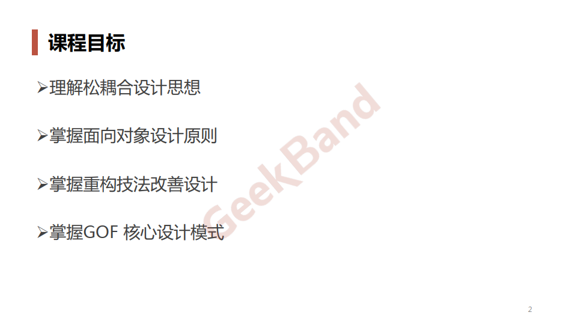
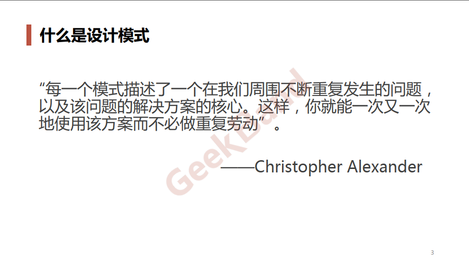
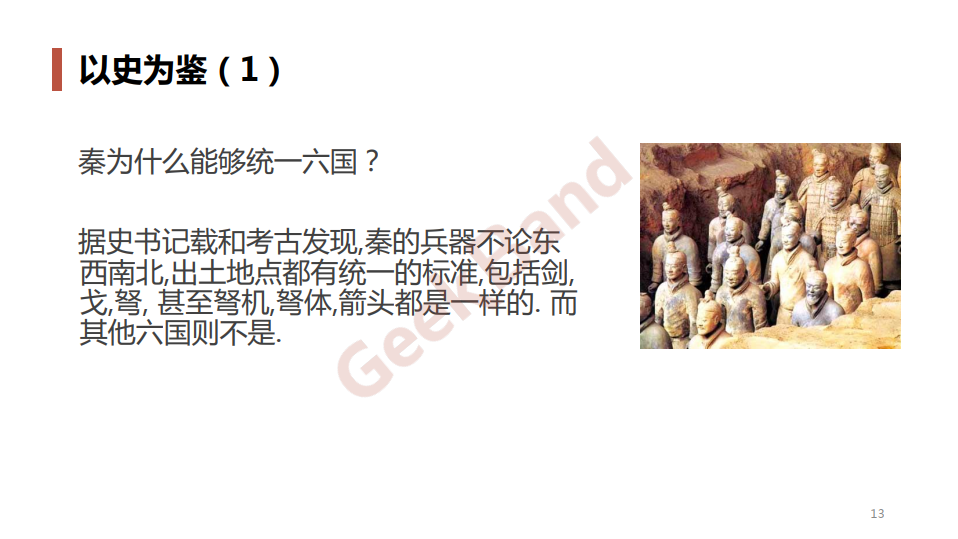
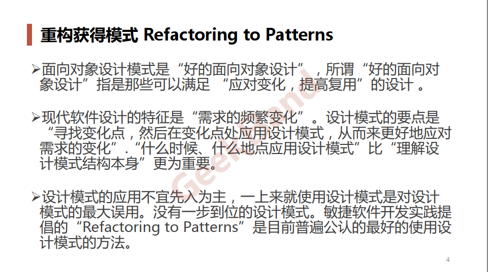

# design_patterns_cpp

设计模式C++实现版本

## 设计模式简介

## 面向对象设计原则

## 具体模式

### 创建型模式

- 简单工厂

- 工厂方法

- 抽象工厂

- 生成器

- 原型

- 单例

### 结构型模式

- 适配器

- 桥接

- 组合

- 装饰器

- 外观

- 享元

- 代理

### 行为型模式

- 职责链

- 命令

- 解释器

- 迭代器

- 中介者

- 备忘录

- 观察者

- 状态

- 策略

- 模板方法

- 访问器

## 总结

