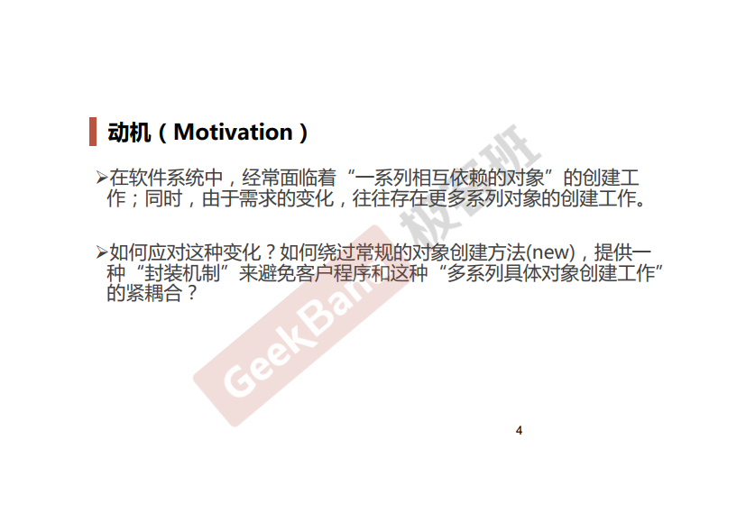
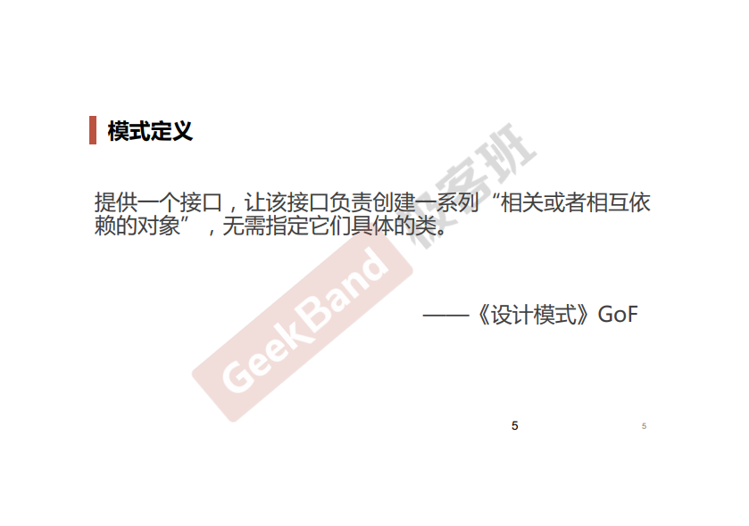
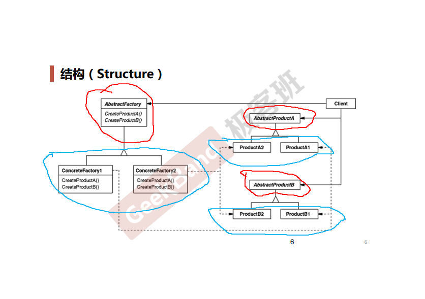
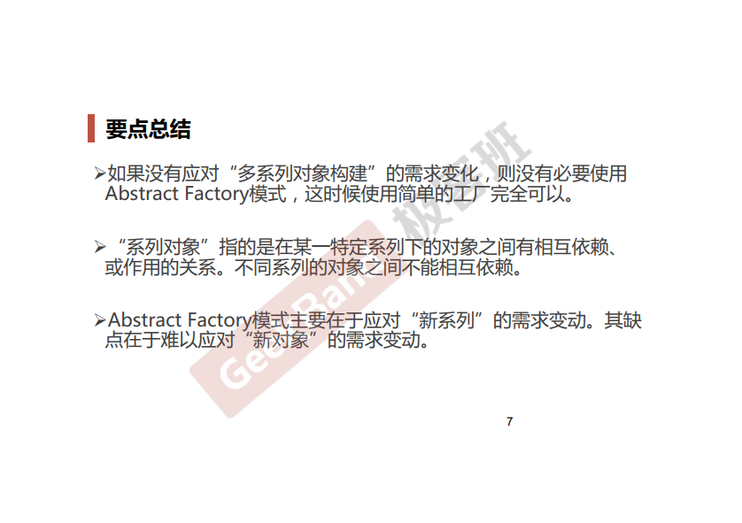

### 一. 导入: 抽象工厂模式





### 二. 举例说明

有这样一个场景: 数据库访问分connection, command和reader等步骤. 同时也存在不同的数据库访问, 比如Oracle, SQL Server, MySQL等.

**最初始版本**

EmployeeDAO1.cpp

```cpp
class EmployeeDAO {
public:
    vector<EmployeeDO> GetEmployees() {
        SqlConnection* connection = 
            new SqlConnection();
        connection->ConnectionString("...");

        SqlCommand* command = 
            new SqlCommand();
        command->CommandText("...");
        command->SetConnection(connection);

        SqlDataReader* reader = command->ExecuteReader();
        while (reader->Read())
        {
            ;
        }
    }
}
```

**工厂模式**

```cpp
// 数据库访问有关基类
class IDBConnection {

};

class IDBConnectionFactory {
public:
    virtual IDBConnection* CreateDBConnection() = 0;
};

class IDBCommand {

};

class IDBCommandFactory {
public:
    virtual IDBCommand* CreateIDBCommand() = 0;
};

class IDataReader {

};

class IDataReaderFactory {
public:
    virtual IDataReader* CreateIDataReader() = 0;
};

// 支持SQL Server
class SqlConnection:public IDBConnection {

};

class SqlConnectionFactory:public IDBConnectionFactory {

};

class SqlCommand:public IDBCommand{
    
};

class SqlCommandFactory:public IDBCommandFactory{
    
};


class SqlDataReader:public IDataReader{
    
};

class SqlDataReaderFactory:public IDataReaderFactory{
    
};

// 支持Oracle
class OracleConnection:public IDBConnection{
    
};

class OrcaleConnectionFactory:public IDBConnectionFactory {

};

class OracleCommand:public IDBCommand{
    
};

class OracleCommandFactory:public IDBCommandFactory {

}

class OracleDataReader:public IDataReader{
    
};

class OracleDataReaderFactory:public IDataReaderFactory {

};

class EmployeeDAO {
    IDBConnectionFactory* dbConnectionFactory;
    IDBCommandFactory* dbCommandFactory;
    IDataReaderFactory* dataReaderFactory;

public:
    vector<EmployeeDO> GetEmployees() {
        IDBConnection* connection =
            dbConnectionFactory->CreateDBConnection();
        connection->ConnectionString("...");

        IDBCommand* command =
            dbCommandFactory->CreateDBCommand();
        command->CommandText("...");
        command->SetConnection(connection); //关联性

        IDBDataReader* reader = command->ExecuteReader(); //关联性
        while (reader->Read()){

        }
    }
};
```

上述代码有个问题: connection, command, reader具有关联性, 必须属于同一种数据库. 比如说connection属于Oracle的, command属于SQL Server的就会有问题. 因此就会引出我们的**抽象工厂**方法.

```cpp
// 数据库访问有关的基类
class IDBConnection {

};

class IDBCommand {

};

class IDataReader {

};

class IDBFactory {
public:
    virtual IDBConnection* CreateDBConnection() = 0;
    virtual IDBCommand*    CreateDBCommand() = 0;
    virtual IDataReader*   CreateDataReader() = 0;
};

// 支持SQL Server
class SqlConnection:public IDBConnection {

};

class SqlCommand:public IDBCommand {

};

class SqlDataReader:public IDataReader {

};

class SqlDBFactory:public IDBFactory {
public:
    IDBConnection* CreateDBConnection() {
        return new SqlConnection();
    }
    IDBCommand*    CreateDBCommand() {
        return new SqlDBCommand();
    }
    IDataReader*   CreateDataReader() {
        return new SqlDataReader();
    }
};

//支持Oracle
class OracleConnection:public IDBConnection {
    
};

class OracleCommand:public IDBCommand {

};

class OracleDataReader: public IDataReader {
    
};

class OracleDBFactory:public IDBFactory {
public:
    IDBConnection* CreateDBConnection() {
        return new OracleConnection();
    }
    IDBCommand*    CreateDBCommand() {
        return new OracleCommand();
    }
    IDataReader*   CreateDataReader() {
        return new OracleDataReader();
    } 
};

class EmployeeDAO {
    IDBFactory* dbFactory;

public:
    vector<EmployeeDO> GetEmployees() {
        IDBConnection* connection =
            dbFactory->CreateDBConnection();
        connection->ConnectionString("...");

        IDBCommand* command =
            dbFactory->CreateDBCommand();
        command->CommandText("...");
        command->SetConnection(connection); //关联性

        IDBDataReader* reader = command->ExecuteReader(); //关联性
        while (reader->Read()){

        }
    }
};
```

### 三. 结构总结

红色的部分是稳定的, 蓝色的部分是变化的. 让client依赖红色的部分.






