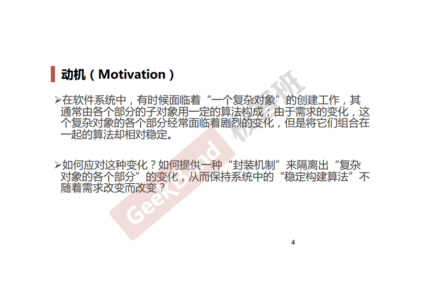
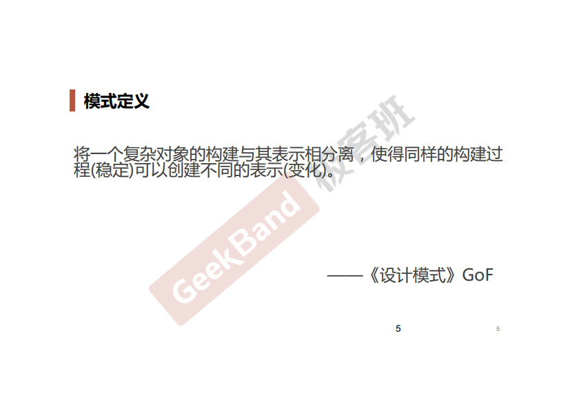
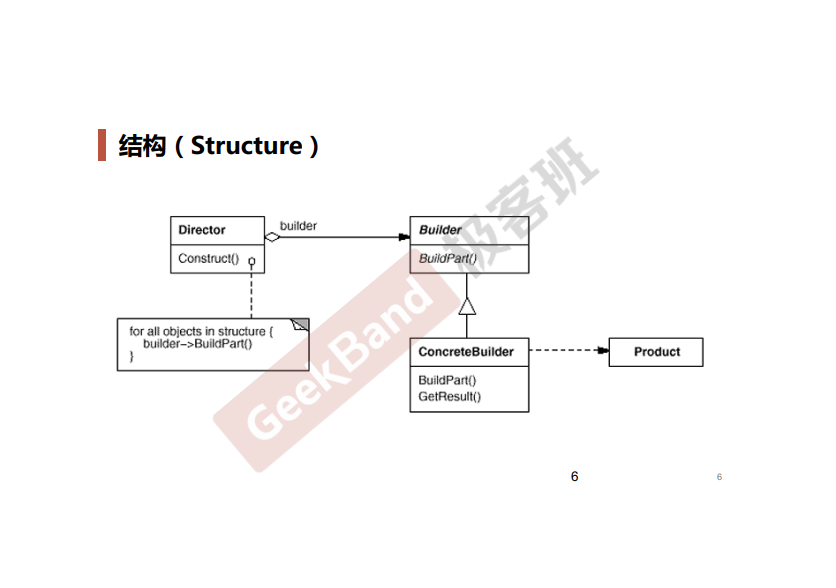
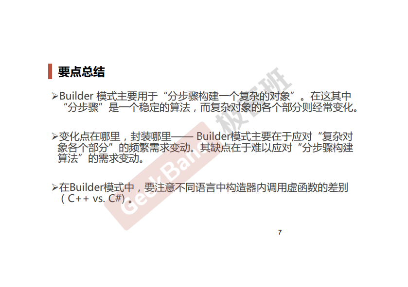

### 一. 导入: Builder模式





### 二. 举例说明

构造PC和Notebook的流程是一样的, 但是每个步骤又互相不一样.

```cpp
class Builder {
public:
    virtual void SelectCpu() = 0;
    virtual void SelectMatherboard() = 0;
    virtual void SelectMem() = 0;
    virtual void SelectDisk() = 0;
    virtual void SelectPower() = 0;
    virtual void SelectShell() = 0;
};

// 构造PC
class PCBuilder: public Builder
{
public:
    void SelectCpu()         { cout<<"Select PC Cpu"<<endl; }
    void SelectMatherboard() { cout<<"Select PC Matherboard"<<endl; }
    void SelectMem()         { cout<<"Select PC Mem"<<endl; }
    void SelectDisk()        { cout<<"Select PC Disk"<<endl; }
    void SelectPower()       { cout<<"Select PC Power"<<endl; }
    void SelectShell()       { cout<<"Select PC Shell"<<endl; }
};

// 构造NoteBook
class NoteBookBuilder : public Builder
{
public:
    void SelectCpu()         { cout<<"Select NoteBook Cpu"<<endl; }
    void SelectMatherboard() { cout<<"Select NoteBook Matherboard"<<endl; }
    void SelectMem()         { cout<<"Select NoteBook Mem"<<endl; }
    void SelectDisk()        { cout<<"Select NoteBook Disk"<<endl; }
    void SelectPower()       { cout<<"Select NoteBook Power"<<endl; }
    void SelectShell()       { cout<<"Select NoteBook Shell"<<endl; }
};

// 构造的指挥官
class Director
{
private:
    Builder *m_pBuilder;
public:
    Director(Builder *builder) 
    {
        m_pBuilder = builder;
    }

    void Create() 
    {
        m_pBuilder->SelectCpu();
        m_pBuilder->SelectMatherboard();
        m_pBuilder->SelectMem();
        m_pBuilder->SelectDisk();
        m_pBuilder->SelectPower();
        m_pBuilder->SelectShell();
    }
};

int main(int argc, char *argv[])
{
    NoteBookBuilder thin;
    Director director(&thin);
    director.Create();

    return 0;
}
```

### 三. 结构总结

Builder模式特别像Template Method模式.



