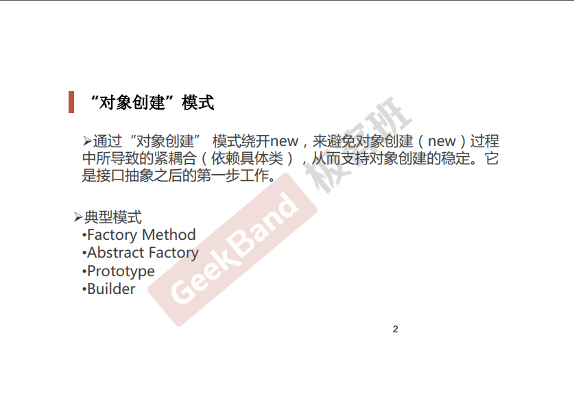
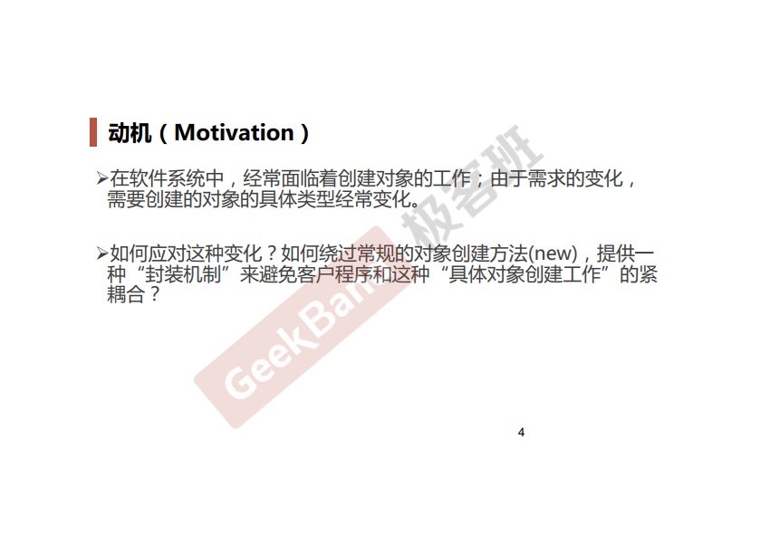
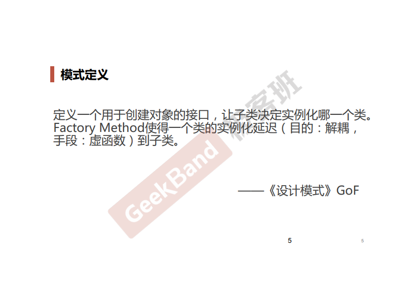
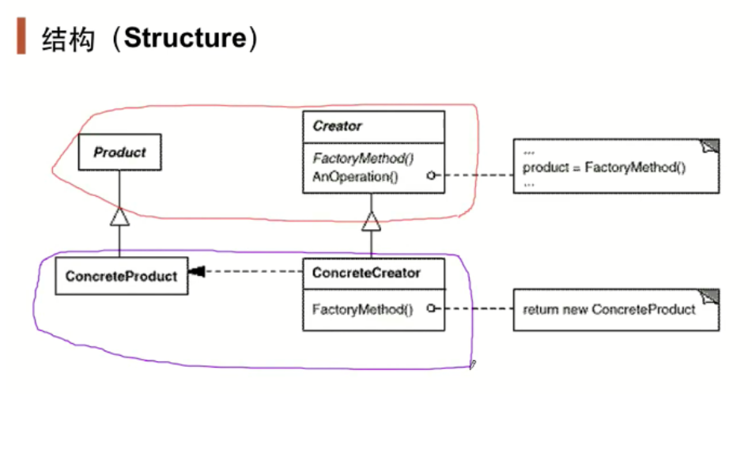
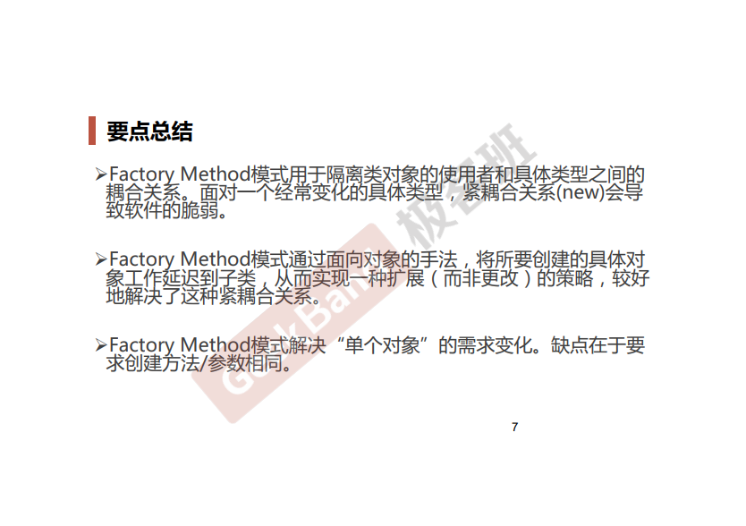

### 一. 导入: "对象创建"模式和工厂模式





### 二. 举例说明

有这样一个场景: 需要在MainForm中设计一个按钮, 这个按钮具有文件分割的功能, 支持多种类型的文件分割, 比如二进制类型, 文本类型等.

**不使用工厂模式的设计场景**:

MainForm.cpp:

```cpp
#include "Split.hpp"

class MainForm
{
public:
    MainForm() {}

    void BtnClick()
    {
        ISplit *splitter = new BinarySplit();
        splitter->SplitFunc();
    }
};
```

Split.hpp

```cpp
#pragma once
#include <stdio.h>

// 抽象基类
class ISplit
{
    ISplit() {}
    virtual ~ISplit() {}
    virtual void SplitFunc() = 0;
};

// 具体类
class BinarySplit : public ISplit
{
public:
    void SPlitFunc()
    {
        printf("This is BinarySplit\n");
    }
};

class TxtSplit : public ISplit
{
public:
    void SplitFunc()
    {
        printf("This is TxtSplit\n");
    }
}
```

可以看到**即便**是Split.cpp中使用了**多态**的方法, 在MainForm.cpp中的Btn1Click()**还是会依赖于具体的类型**, 如果要实现其他类别的split函数, 就需要在函数里填写, 很不符合代码的复用性.

**引入工厂模式后的场景**

Split.hpp保持不变

增加SplitFactory.hpp文件

```cpp
#include "Split.hpp"

// 工厂基类
class ISplitFactory
{
public:
    ISplitFactory() {}
    virtual ~ISplitFactory() {}
    virtual ISplit *CreateSplitter() = 0;
};

// 具体工厂
class BinarySplitFactory : public ISplitFactory
{
public:
    ISplit *CreateSplitter()
    {
        return new BinarySplit();
    }
};

class TxtSplitFactory : public ISplitFactory
{
public:
    ISpilt *CreateSplitter()
    {
        return new TxtSplit();
    }
}
```

修改MainForm.cpp文件:

```cpp
#include "Split.hpp"
#include "SplitFactory.hpp"

class MainForm
{
    ISplitFactory *splitFactory;
    MainForm(ISplitFactory *splitFactory) 
    {
        this->splitFactory = splitFactory;
    }

    void Btn1Click()
    {
        ISplit *splitter = splitFactory->CreateSplitter(); // 通过工厂模式做成了"多态new"
        splitter->SplitFunc();
    }
};
```

这里增加的工厂基类同样定义了一个纯虚函数, 用来创建Split对象, 而实现的过程在子类中进行实现, 这样的话就相当于延迟到子类.

上面的情况在MainForm.cpp中通过接收传递过来的splitFactory来确定运行时应该执行谁的函数. 在这种模式下, 对具体类型的依赖被放到了外边(main.cpp这个调用放方了). 而上述代码里面不再存在依赖.

此时的main函数:

```cpp
int main(int argc, char *argv[])
{
    ISplitFactory *splitFactory = new BinarySplitFactory();
    MainForm mf(splitFactory);
    mf.Btn1Click();

    return 0;
}
```
// 注:这里没有考虑内存管理, 正常应该在析构函数中delete掉堆上的内存

### 三. 结构总结

红色的部分是稳定的, 蓝色的部分是变化的. 让MainForm依赖红色的部分.






