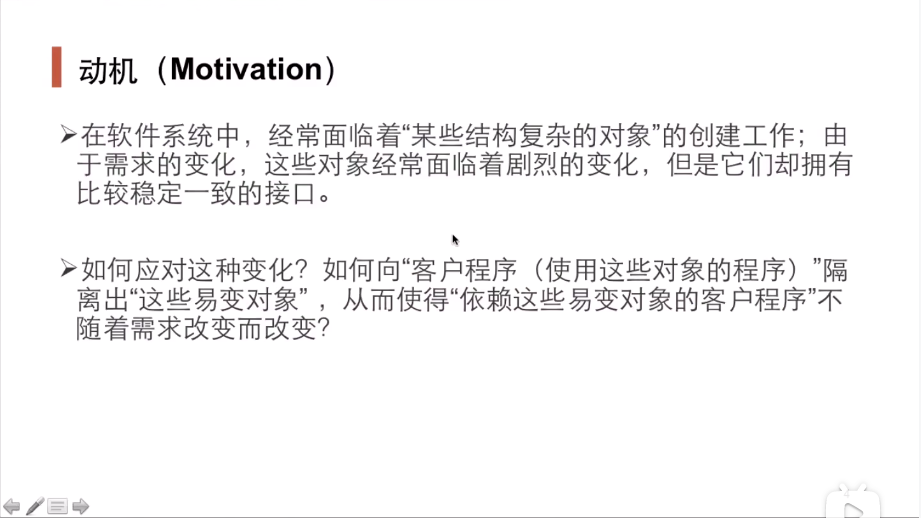
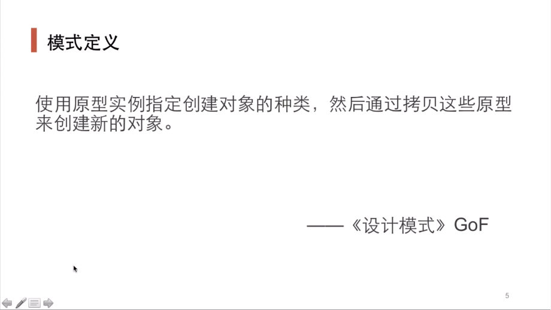
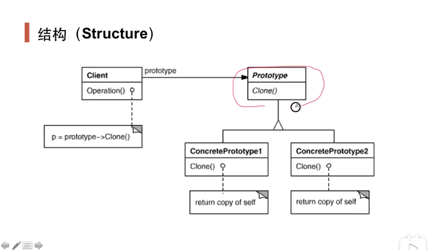
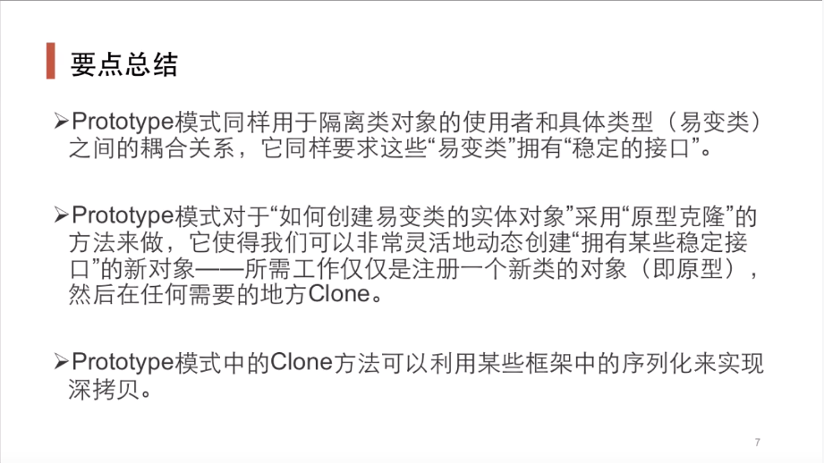

### 一. 导入: Prototype模式





### 二. 举例说明

```cpp
#include <iostream>
#include <cstring>

using namespace std;

class Student 
{
protected:
    int id;
    char name[10];

public:
    Student(){}
    ~Student() 
    {
        cout << "Desconstruct..." << endl;
    }
    virtual Student *Clone()
    {

    }

    virtual void Show()
    {

    }
};

class StudentTypeA: public Student
{
public:
    StudentTypeA(const char *name_input)
    {
        strcpy(name, name_input);
        this->id = 0;
        cout << "Construction..." << endl;
    }

    StudentTypeA(const StudentTypeA &other) 
    { 
        cout << "Copy Construction..." << endl; 
        this->id = other.id; 
        this->id++; 
        strcpy(this->name, other.name); 
    }

    virtual StudentTypeA *Clone()
    {
        StudentTypeA *tmp = new StudentTypeA(*this);
        return tmp;
    }

    void Show()
    {
        cout << "Student id == " << id << " name == " << name <<endl;
    }

    ~StudentTypeA()
    {
        cout << "Deconstruction StudentTypeA" << endl;
    }
};

int main(int argc, char *argv[])
{
    Student *student1 = new StudentTypeA("fulima"); 
    Student *student2 = student1->Clone(); 
    Student *student3 = student2->Clone();
      
    student1->Show(); 
    student2->Show(); 
    student3->Show();

    return 0;
}
```

### 三. 结构总结



