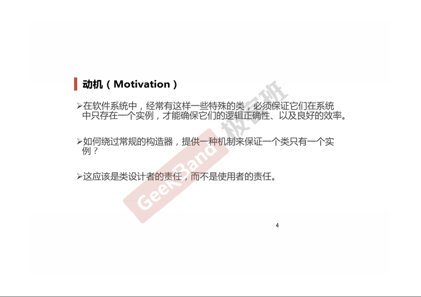
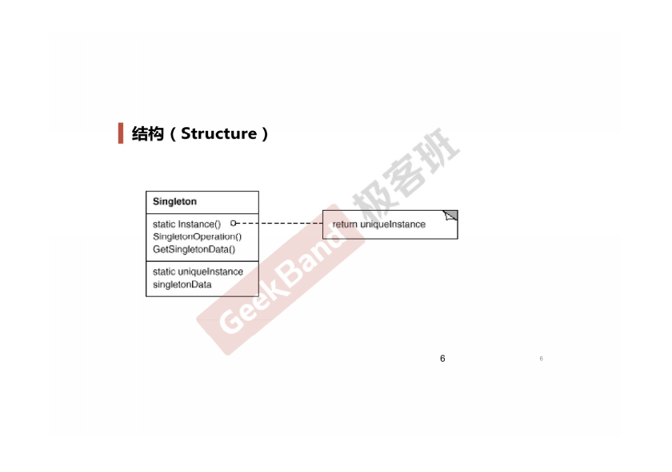
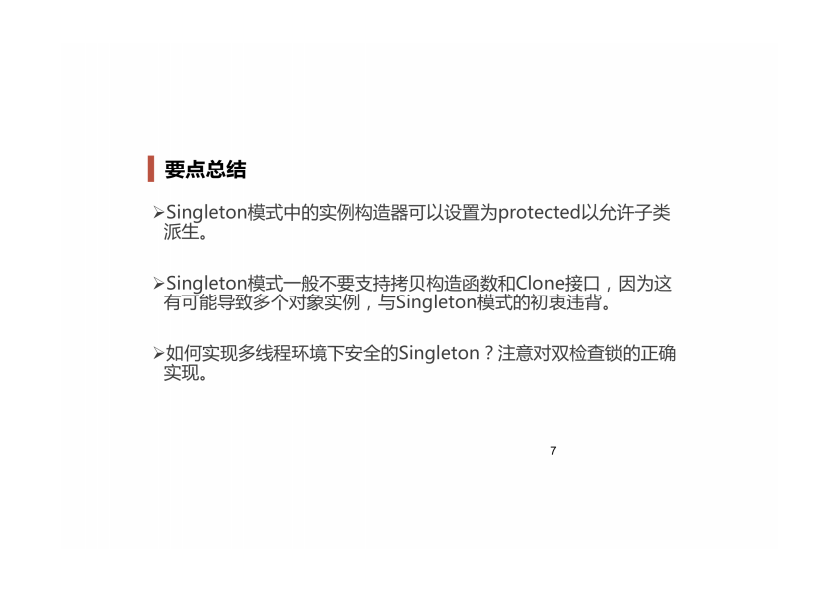

### 一. 导入: Singleton模式




### 举例说明

```cpp
class Singleton
{
private:
    Singleton();
    Singleton(const Singleton& other);

public:
    static Singleton* getInstance();
    static Singleton* m_instance;
};

Singleton* Singleton::m_instance = nullptr;

// 线程非安全版本
Singleton* Singleton::getInstance() 
{
    if (m_instance == nullptr)
    {
        m_instance = new Singleton();
    }
    return m_instance;
}

// 线程安全版本, 但锁的代价过高
Singleton* Singleton::getInstance()
{
    Lock lock;
    if (m_instance == nullptr)
    {
        m_instance = new Singleton();
    }
    return m_instance;
}

// 双检查锁, 但由于内存读写reorder不安全
Singleton* Singleton::getInstance() {
    
    if(m_instance==nullptr) {
        Lock lock;
        if (m_instance == nullptr) {
            m_instance = new Singleton();
        }
    }
    return m_instance;
}

// 内存读写reorder是指: m_instance = new Singleton();
// 这句的正常执行顺序是先分配内存, 再进行构造函数初始化, 最后将内存地址返回给m_instance. 
// 编译器某些情况下会调整顺序, 分配好内存之后, 先将内存地址返回给m_instance, 再进行构造函数初始化.
// 这就会遇到一种情况: 线程A执行到m_instance = new Singleton();这一行, 内存分配好之后, 还没有初始化就返回了. 然后线程B执行第一条if(m_instance==nullptr)判断, 不满足就直接返回了return m_instance; 而此时线程B返回的m_instance是未初始化的.

// C++11版本之后的跨平台实现(Java C#中有volatile关键字解决)
std::atomic(Singleton*) Singleton::m_instance;
std::mutex Singleton::m_mutex;

Singleton* Singleton::getInstance()
{
    Singleton* tmp = m_instance.load(std::memory_order_relaxed);
    std::atomic_thread_fence(std::memory_order_acquire);// 获取内存fence
    if (tmp == nullptr)
    {
        std::lock_guard<std::mutex> lock(m_mutex);
        tmp = m_instance.load(std::memory_order_relaxed);
        if (tmp == nullptr)
        {
            tmp = new Singleton;
            std::atomic_thread_fence(std::memory_order_release);// 释放内存fence
            m_instance.store(tmp, std::memory_order_relaxed);
        }
    }
}
```

### 三. 结构总结




