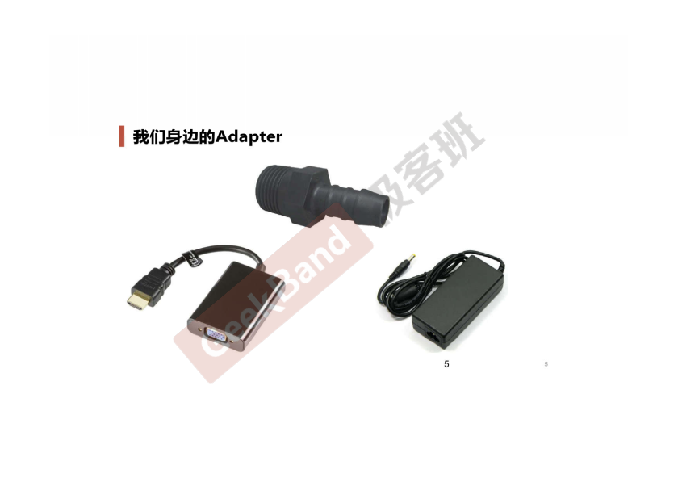
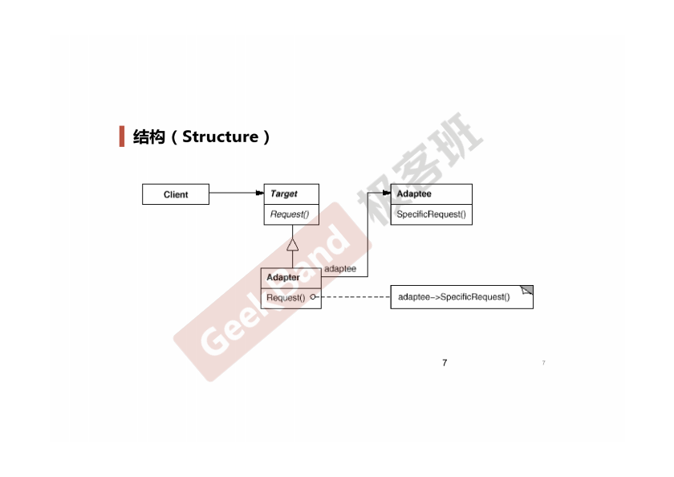

### 一. 导入: Adapter模式





### 二. 举例说明

```cpp
// 目标接口(新接口)
class ITarget 
{
public:
    virtual void process() = 0;
};

// 遗留接口(老接口)
class IAdaptee 
{
public:
    virtual void foo(int data) = 0;
    virtual int bar() = 0;
};

// 遗留类型
class OldClass: public IAdaptee 
{
    virtual void foo(int data)
    {
        ;
    }

    virtual int bar()
    {
        ;
    }
};

// 对象适配器
class Adapter: public ITarget {
protected:
    IAdaptee* pAdaptee; // 组合

public:
    Adapter(IAdaptee *pAdaptee)
    {
        this->pAdaptee = pAdaptee;
    }

    virtual void process()
    {
        int data = pAdaptee->bar();
        pAdaptee->foo(data);
    }
};

// 类适配器通过public继承获得接口继承的效果，通过protected继承获得实现继承的效果
// (这种方式尽量少用, 用到了多继承, 还依赖于具体的OldClass)
class Adapter2: public ITarget,
                protected OldClass 
{
public:
  Adapter2(){}
  ~Adapter2(){}
  virtual void process()//实现Target定义的process接口
  {
    int data = this->bar();
    this->foo(data);
  }
};

int main(int argc, char *argv[])
{
    IAdaptee* pAdaptee = new OldClass();

    ITarget* pTarget = new Adapter(pAdaptee);
    pTarget->process();

    return 0;
}
```

### 三. 结构总结



