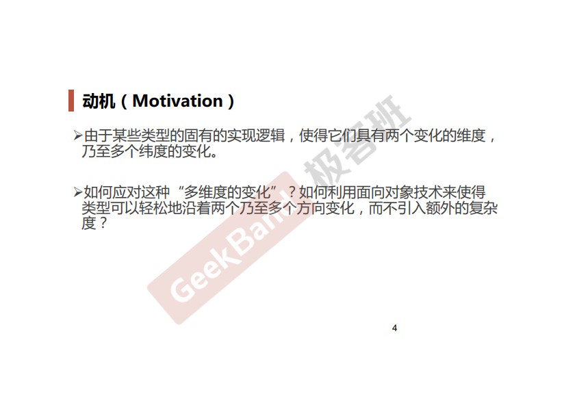
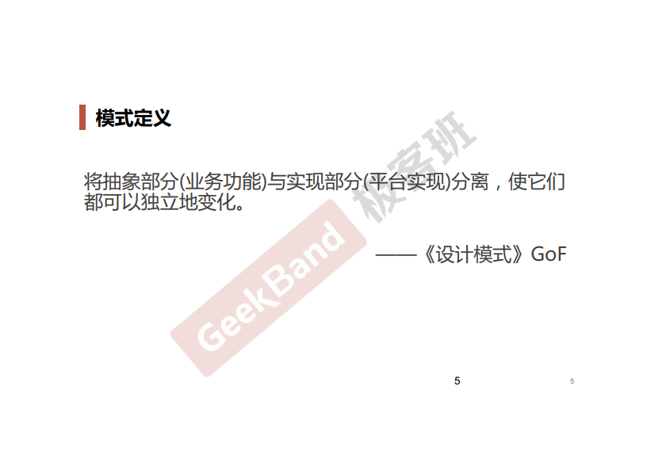
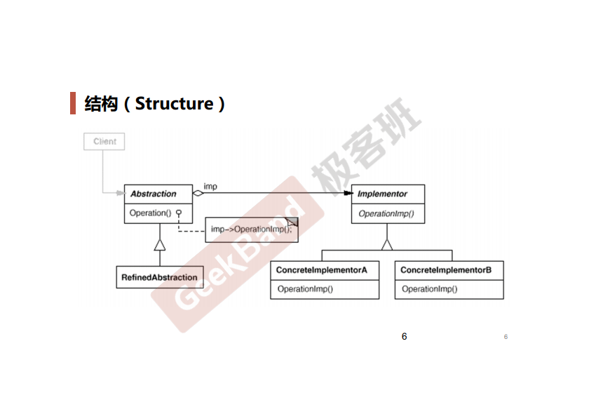
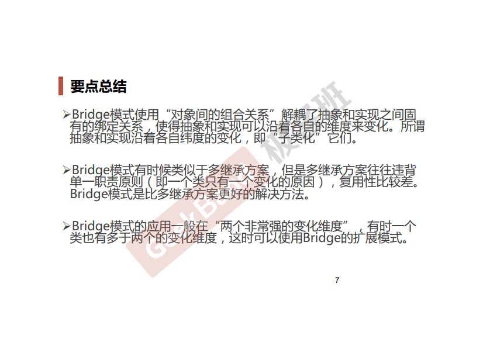

### 一. 导入: Bridge模式





### 二. 举例说明

**未使用桥接模式**

```cpp
class Messager
{
public:
    virtual void Login(string username, string password) = 0;
    virtual void SendMessage(string message) = 0;
    virtual void SendPicture(Image image) = 0;

    virtual void PlaySound() = 0;
    virtual void DrawShape() = 0;
    virtual void WriteText() = 0;
    virtual void Connect() = 0;

    virtual ~Messager() {}
};

// 平台实现
class PCMessageBase: public Messager
{
public:
    virtual void PlaySound()
    {
        //**********
    }

    virtual void DrawShape()
    {
        //**********
    }

    virtual void WriteText()
    {
        //**********
    }

    virtual void Connect()
    {
        //**********
    }
};

class MobileMessagerBase: public Messager
{
public:
    virtual void PlaySound()
    {
        //==========
    }

    virtual void DrawShape()
    {
        //==========
    }

    virtual void WriteText()
    {
        //==========
    }

    virtual void Connect()
    {
        //==========
    }
};

// 业务抽象
class PCMessagerLite: public PCMessagerBase
{
public:
    virtual void Login(string username, string password)
    {
        PCMessagerBase::Connect();
        //......
    }

    virtual void SendMessage(string message)
    {
        PCMessagerBase::WriteText();
        //......
    }

    virtual void SendPicture(Image image)
    {
        PCMessagerBase::DrawShape();
        //......
    }
};

class PCMessagerPerfect: public PCMessagerBase
{
public:
    virtual void Login(string username, string password)
    {
        PCMessagerBase::PlaySound();
        //**********
        PCMessagerBase::Connect();
        //..........
    }

    virtual void SendMessage(string message)
    {
        PCMessagerBase::PlaySound();
        //**********
        PCMessagerBase::WriteText();
        //..........
    }

    virtual void SendPicture(Image image)
    {
        PCMessagerBase::PlaySound();
        //**********
        PCMessagerBase::DrawShape();
        //..........
    }
};

class MobileMessagerLite: public MobileMessagerBase
{
public:
    virtual void Login(string username, string password)
    {
        MobileMessagerBase::Connect();
        //..........
    }

    virtual void SendMessage(string message)
    {
        
        MobileMessagerBase::WriteText();
        //........
    }
    
    virtual void SendPicture(Image image)
    {
        
        MobileMessagerBase::DrawShape();
        //........
    }
};

class MobileMessagerPerfect : public MobileMessagerBase 
{
public:
    
    virtual void Login(string username, string password)
    {    
        MobileMessagerBase::PlaySound();
        //********
        MobileMessagerBase::Connect();
        //........
    }
    
    virtual void SendMessage(string message)
    {    
        MobileMessagerBase::PlaySound();
        //********
        MobileMessagerBase::WriteText();
        //........
    }
    
    virtual void SendPicture(Image image)
    {    
        MobileMessagerBase::PlaySound();
        //********
        MobileMessagerBase::DrawShape();
        //........
    }
};

void Process()
{
    // 编译时装配
    Messager *m = new MobileMessagerPerfect();
}
```


假设平台有N种, 业务有M种, 则需要实现的类的数目为1+N+N*M, N和M稍微大点就会造成数量爆炸.

让我们来看看用桥接模式, 代码能精简到什么样子.

**使用桥接模式**

```cpp
class Messager
{
protected:
    MessagerImp* messagerImp; //...

public:
    virtual void Login(string username, string password) = 0;
    virtual void SendMessage(string message) = 0;
    virtual void SendPicture(Image image) = 0;

    virtual ~Messager(){}
};

class MessagerImp
{
public:
    virtual void PlaySound() = 0;
    virtual void DrawShape() = 0;
    virtual void WriteText() = 0;
    virtual void Connect() = 0;

    virtual MessagerImp() = 0;
}

// 平台实现N
class PCMessagerImp: public MessagerImp
{
public:
    virtual void PlaySound()
    {
        //**********
    }
    virtual void DrawShape()
    {
        //**********
    }
    virtual void WriteText()
    {
        //**********
    }
    virtual void Connect()
    {
        //**********
    }
};

class MobileMessagerImp: public MessagerImp
{
public:
    virtual void PlaySound()
    {
        //==========
    }
    
    virtual void DrawShape()
    {
        //==========
    }
    
    virtual void WriteText()
    {
        //==========
    }
    virtual void Connect()
    {
        //==========
    }
};

// 业务抽象M
class MessagerLite: public Messager
{
public:
    virtual void Login(string username, string password)
    {
        messagerImp->Connect();
        //..........
    }

    virtual void SendMessage(string message)
    {
        messagerImp->WriteText();
        //..........
    }

    virtual void SendPicture(Image image)
    {
        messagerImp->DrawShape();
        //..........
    }
};

class MessagerPerfect  :public Messager 
{   
public:    
    virtual void Login(string username, string password)
    { 
        messagerImp->PlaySound();
        //********
        messagerImp->Connect();
        //........
    }

    virtual void SendMessage(string message)
    {    
        messagerImp->PlaySound();
        //********
        messagerImp->WriteText();
        //........
    }

    virtual void SendPicture(Image image)
    {
        
        messagerImp->PlaySound();
        //********
        messagerImp->DrawShape();
        //........
    }
};

void Process()
{
    //运行时装配
    MessagerImp* mImp = new PCMessagerImp();
    Messager *m = new MessagerLite(mImp);
}
```

桥接模式下类的数目降到了1+N+M.

所谓的桥接我感觉就是把类的继承变成了对象间的组合. MessagerImp充当了"Bridge"的作用.

### 三. 结构总结





