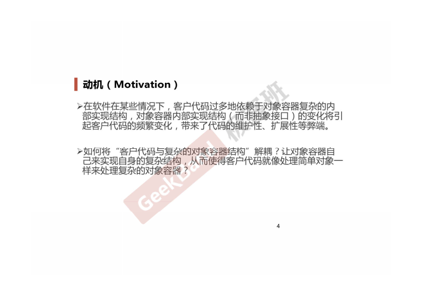
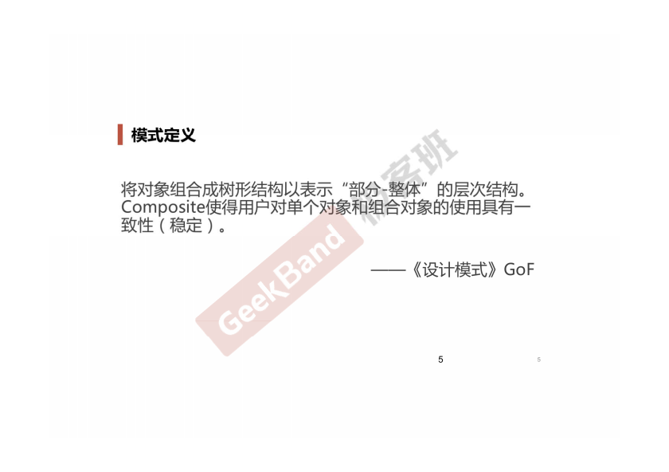
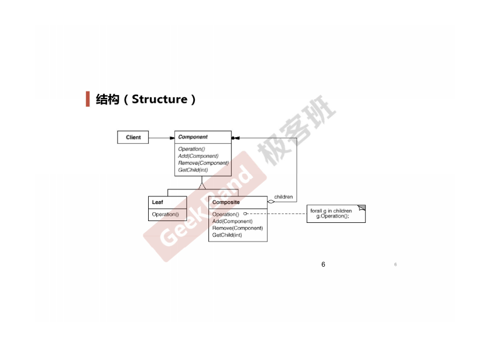
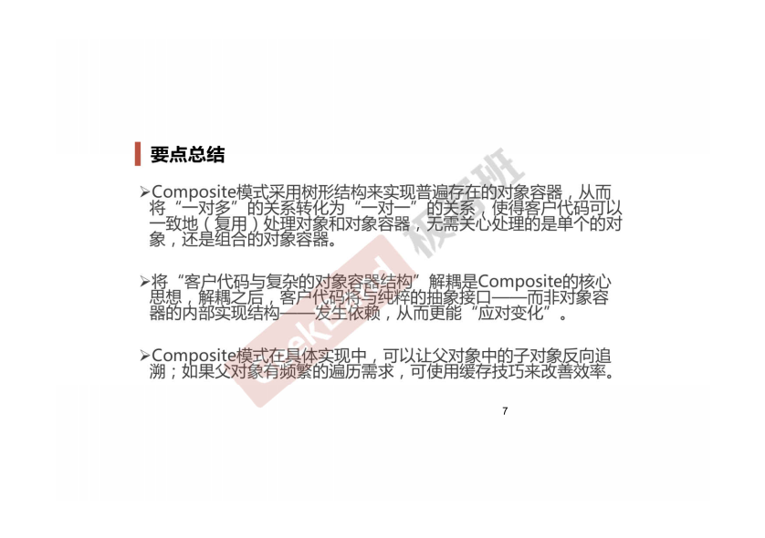

### 一. 导入: Composite模式





### 二. 举例说明

```cpp
#include <iostream>
#include <list>
#include <string>
#include <algorithm>

using namespace std;

class Component
{
public:
    virtual void process() = 0;
    virtual ~Component(){}
};

// 树节点
class Composite: public Component 
{
    string name;
    list<Component*> elements;

public:
    Composite(const string &s): name(s) {}

    void add(Component* element)
    {
        elements.push_back(element);
    }

    void remove(Component* element)
    {
        elements.remove(element);
    }

    void process()
    {
        // 1. process current node

        // 2. process left nodes
        for (auto &e: elements)
        {
            e->process(); // 多态调用
        }
    }
};

// 叶子节点
class Leaf: public Component
{
    string name;
public:
    Leaf(string s): name(s) {}

    void process()
    {
        // process current node
    }
};

void Invoke(Component &c)
{
    //...
    c.process();
    //...
}

int main(int argc, char *argv[])
{

    Composite root("root");
    Composite treeNode1("treeNode1");
    Composite treeNode2("treeNode2");
    Composite treeNode3("treeNode3");
    Composite treeNode4("treeNode4");
    Leaf leaf1("leaf1");
    Leaf leaf2("leaf2");
    
    root.add(&treeNode1);
    treeNode1.add(&treeNode2);
    treeNode2.add(&leaf1);
    
    root.add(&treeNode3);
    treeNode3.add(&treeNode4);
    treeNode4.add(&leaf2);
    
    process(root);
    process(leaf2);
    process(treeNode3);
  
}
```

### 三. 结构总结



