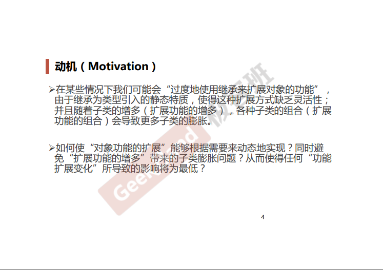
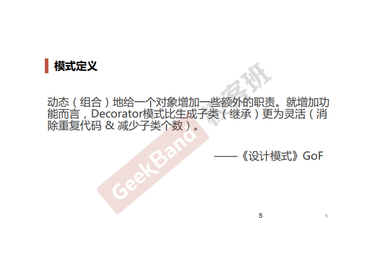
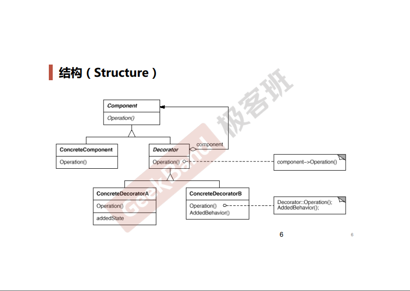

### 一. 导入: Decorator模式





### 二. 举例说明

**原始版本**

```cpp
class Stream
{
public:
    virtual char Read(int number) = 0;
    virtual void Seek(int position) = 0;
    virtual void Write(char data) = 0;

    virtual ~Stream(){}
};

// 主体类
class FileStream: public Stream 
{
public:
   virtual char Read(int number)
   {
       // 读文件流
   }

   virtual void Seek(int position)
   {
       // 定位文件流
   }

   virtual void Write(char data)
   {
       // 写文件流
   }
};

class NetworkStream: public Stream
{
public:
    virtual char Read(int number)
    {
        //读网络流
    }

    virtual void Seek(int position)
    {
        //定位网络流
    }
    
    virtual void Write(char data)
    {
        //写网络流
    }
}

class MemoryStream: public Stream
{
public:
    virtual char Read(int number)
    {
        // 读内存流
    }

    virtual void Seek(int position)
    {
        // 定位内存流
    }

    virtual void Write(char data)
    {
        // 写内存流
    }
};

// 扩展操作
class CryptoFileStream: public FileStream
{
public:
    virtual char Read(int number)
    {
        // 额外的加密操作...
        FileStream::Read(number); // 读文件流
    }

    virtual void Seek(int position)
    {
        // 额外的加密操作...
        FileStream::Seek(position); // 定位文件流
        // 额外的加密操作...
    }

    virtual void Write(byte data)
    {
        // 额外的加密操作...
        FileStream::Write(data);//写文件流
        // 额外的加密操作...
    }
};

class CryptoNetworkStream: public NetworkStream
{
public:
    virtual char Read(int number)
    {
        // 额外的加密操作...
        NetworkStream::Read(number); // 读网络流
    }

    virtual void Seek(int position)
    {
        // 额外的加密操作...
        NetworkStream::Seek(position); // 定位网络流
        // 额外的加密操作...
    }

    virtual void Write(byte data)
    {
        // 额外的加密操作...
        NetworkStream::Write(data); // 写网络流
        // 额外的加密操作...
    }
};

class CryptoMemoryStream: public MemoryStream
{
public:
    virtual char Read(int number)
    {        
        // 额外的加密操作...
        MemoryStream::Read(number); // 读内存流
    }
    
    virtual void Seek(int position)
    {
        // 额外的加密操作...
        MemoryStream::Seek(position); // 定位内存流
        // 额外的加密操作...
    }

    virtual void Write(byte data)
    {
        // 额外的加密操作...
        MemoryStream::Write(data); // 写内存流
        // 额外的加密操作...
    }
};

class BufferedFileStream: public FileStream
{
    //...
};

class BufferedNetworkStream: public NetworkStream
{
    //...
};

class BufferedMemoryStream: public MemoryStream
{
    //...
}

class CryptoBufferedFileStream: public FileStream
{
public:
    virtual char Read(int number)
    {
        // 额外的加密操作...
        // 额外的缓冲操作...
        FileStream::Read(number); // 读文件流
    }

    virtual void Seek(int position)
    {
        // 额外的加密操作...
        // 额外的缓冲操作...
        FileStream::Seek(position); // 定位文件流
        // 额外的加密操作...
        // 额外的缓冲操作...
    }
    virtual void Write(byte data)
    {
        // 额外的加密操作...
        // 额外的缓冲操作...
        FileStream::Write(data); // 写文件流
        // 额外的加密操作...
        // 额外的缓冲操作...
    }
};

void Process()
{
    // 编译时装配
    CryptoFileStream *fs1 = new CryptoFileStream();

    BufferedFileStream *fs2 = new BufferedFileStream();

    CryptoBufferedFileStream *fs3 = new CryptoBufferedFileStream();
}
```

**中间版本**

```cpp
// 业务操作
class Stream
{
public:
    virtual char Read(int number) = 0;
    virtual void Seek(int position) = 0;
    virtual void Write(char data) = 0;

    virtual ~Stream(){}
};

// 主体类
class FileStream: public Stream
{
public:
    virtual char Read(int number)
    {
        // 读文件流
    }

    virtual void Seek(int position)
    {
        // 定位文件流
    }

    virtual void Write(char data)
    {
        // 写文件流
    }
};

class NetworkStream :public Stream
{
public:
    virtual char Read(int number)
    {
        // 读网络流
    }
    
    virtual void Seek(int position)
    {
        // 定位网络流
    }
    
    virtual void Write(char data)
    {
        // 写网络流
    }
};

class MemoryStream :public Stream
{
public:
    virtual char Read(int number)
    {
        // 读内存流
    }

    virtual void Seek(int position)
    {
        // 定位内存流
    }

    virtual void Write(char data)
    {
        // 写内存流
    }
};

// 扩展操作
class CryptoStream: public Stream {
    Stream* stream; // 一般这种即继承又组合一个类, 大概率是装饰器模式; 继承是为了调用Stream的Read, Seek, Write等方法.

public:
    CrtptoStream(Stream *stm): stream(stm)
    {

    }

    virtual char Read(int number)
    {
        // 额外的加密操作...
        stream->Read(number); // 读文件流
    }

    virtual void Seek(int position)
    {
        // 额外的加密操作...
        stream::Seek(position); // 定位文件流
        // 额外的加密操作...
    }

    virtual void Write(byte data)
    {
        // 额外的加密操作...
        stream::Write(data);//写文件流
        // 额外的加密操作...
    }
};

class BufferedStream: public Stream
{    
    Stream* stream;//...

public:
    BufferedStream(Stream* stm): stream(stm)
    {
        
    }
    
    virtual char Read(int number)
    {
        // 额外的加密操作...
        stream->Read(number); // 读文件流
    }

    virtual void Seek(int position)
    {
        // 额外的加密操作...
        stream::Seek(position); // 定位文件流
        // 额外的加密操作...
    }

    virtual void Write(byte data)
    {
        // 额外的加密操作...
        stream::Write(data);//写文件流
        // 额外的加密操作...
    }
};

void Process()
{
    // 运行时装配
    FileStream* s1 = new FileStream();
    CryptoStream* s2 = new CryptoStream(s1);

    BufferedStream* s3 = new BufferedStream(s1);

    BufferedStream* s4 = new BufferedStream(s2); 
}
```

**最终版本**

```cpp
// 业务操作
class Stream
{
public:
    virtual char Read(int number) = 0;
    virtual void Seek(int position) = 0;
    virtual void Write(char data) = 0;

    virtual ~Stream(){}
};

// 主体类
class FileStream: public Stream
{
public:
    virtual char Read(int number)
    {
        //读文件流
    }
    
    virtual void Seek(int position)
    {
        //定位文件流
    }
    
    virtual void Write(char data)
    {
        //写文件流
    }
};

class NetworkStream: public Stream
{
public:
    virtual char Read(int number)
    {
        // 读网络流
    }

    virtual void Seek(int position)
    {
        // 定位网络流
    }

    virtual void Write(char data)
    {
        // 写网络流
    }
};

class MemoryStream: public Stream
{
public:
    virtual char Read(int number)
    {
        // 读内存流
    }
    
    virtual void Seek(int position)
    {
        // 定位内存流
    }
    
    virtual void Write(char data)
    {
        // 写内存流
    }
    
};

// 扩展操作
DecoratorStream: public Stream
{
protected:
    Stream* stream; // ...

    DecoratorStream(Stream *stm): stream(stm)
    {

    }
};

class CryptoStream: public DecoratorStream
{
public:
    CryptoStream(Stream* stm): DecoratorStream(stm){}

    virtual char Read(int number)
    {   
        // 额外的加密操作...
        stream->Read(number); // 读文件流
    }

    virtual void Seek(int position)
    {
        // 额外的加密操作...
        stream::Seek(position); // 定位文件流
        // 额外的加密操作...
    }

    virtual void Write(byte data)
    {
        // 额外的加密操作...
        stream::Write(data); // 写文件流
        // 额外的加密操作...
    }
};

class BufferedStream: public DecoratorStream
{    
public:
    BufferedStream(Stream* stm): DecoratorStream(stm)
    {
        
    }
    
        virtual char Read(int number)
    {   
        // 额外的加密操作...
        stream->Read(number); // 读文件流
    }

    virtual void Seek(int position)
    {
        // 额外的加密操作...
        stream::Seek(position); // 定位文件流
        // 额外的加密操作...
    }

    virtual void Write(byte data)
    {
        // 额外的加密操作...
        stream::Write(data); // 写文件流
        // 额外的加密操作...
    }
};
```

### 三. 结构总结



