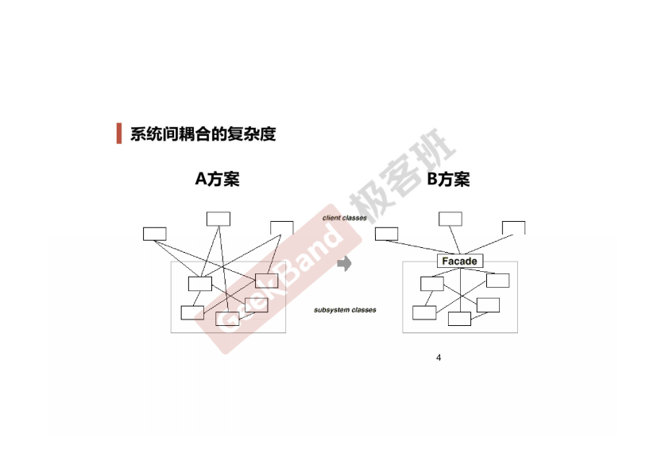
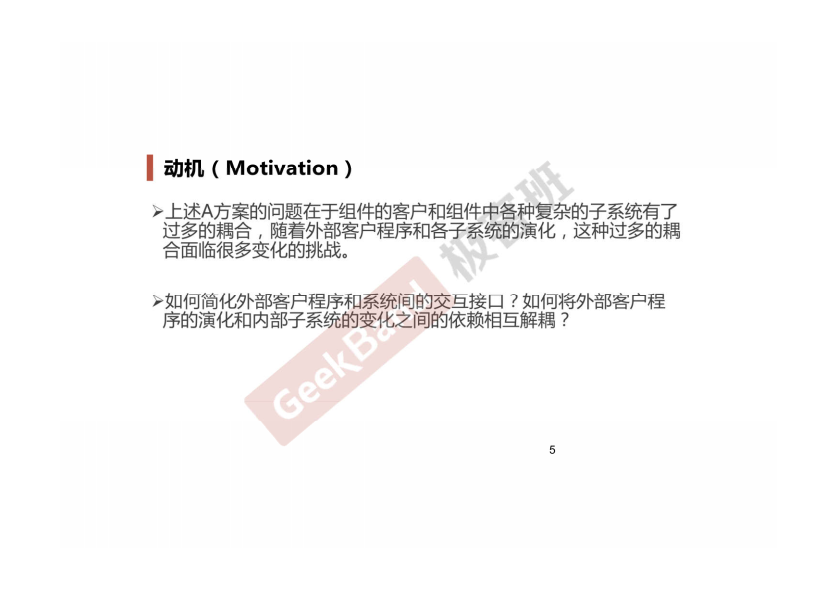
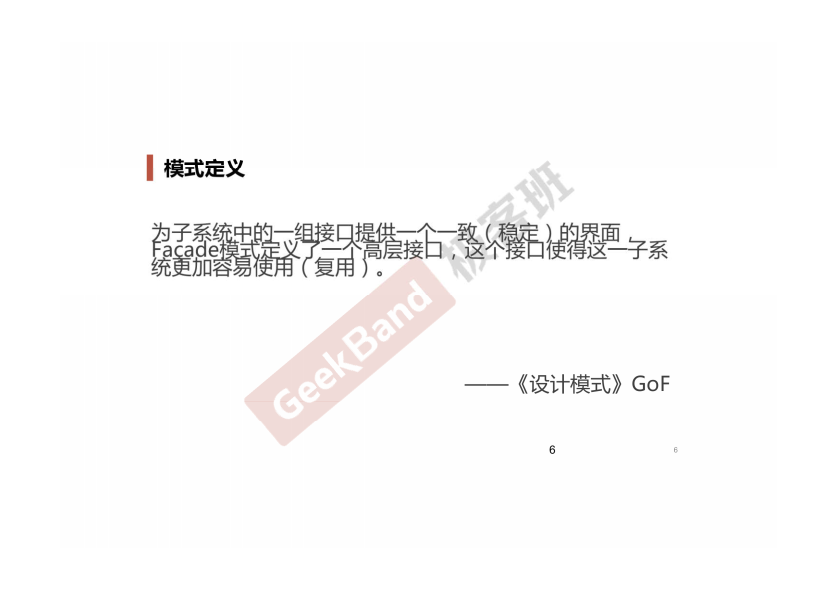

### 一. 导入: Facade模式







### 二. 举例说明

Facade模式更多的是一种软件分层的设计思想.

```cpp
// 复杂或多对象
class ObjectOne
{
public:
    void operator()
    {
        cout<<"operator one\n";
    }
};

class ObjectTwo
{
public:
    void operator() 
  {
    cout<<"operator two\n";
  }
};

class objectThree
{
public:
  void operator() 
  {
    cout<<"operator three\n";
  }
};

class objectFour
{
  public:
  void operator() 
  {
    cout<<"operator four\n";
  }
};

// 外观实现
class Facade
{
    ObjectOne   obj1;
    ObjectTwo   obj2;
    ObjectThree obj3;
    ObjectFour  obj4;

public:
    Facade()
    {
        obj1 = new ObjectOne();
        obj2 = new ObjectTwo();
        obj3 = new ObjectThree();
        obj4 = new ObjectFour();
    }

    void MethodA()
    {
        cout<<" Fun A()-----\n");
        obj1.operator();
        obj2.operator();
        obj3.operator();
        obj4.operator();
    }

    void MethodB()
    {
        cout<<" Fun B()-----\n");
        obj4.operator();
        obj3.operator();
        obj2.operator();
        obj1.operator();
    }
}

// 调用
int main(int argc, char *argv[]) 
{
    Facade facade = new Facade();
    facade.MethodA();
    facade.MethodB();

    return 0;
}
```

### 三. 结构总结

