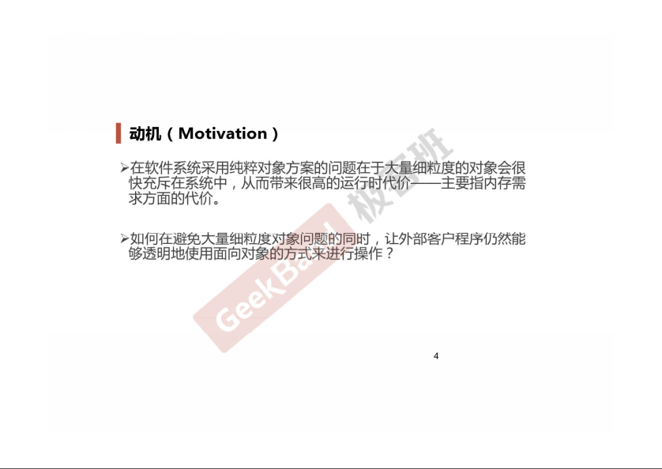
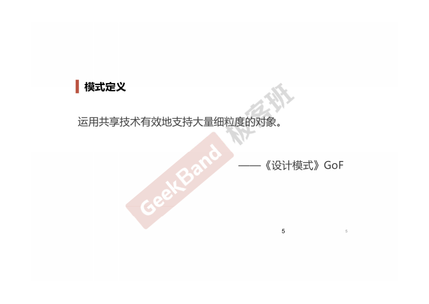
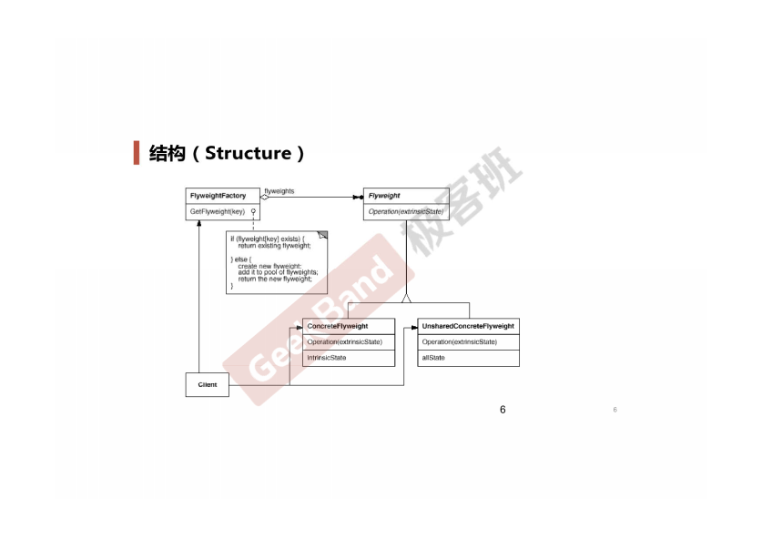
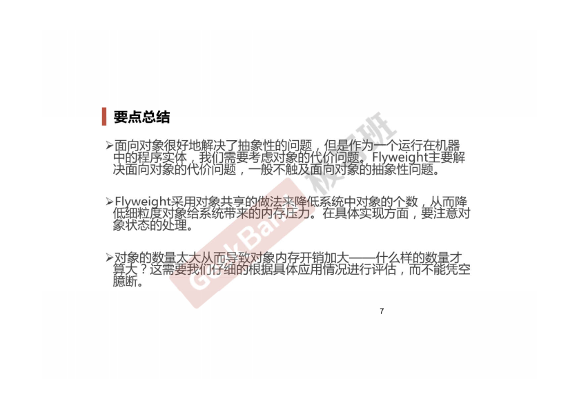

### 一. 导入: Flyweight模式





### 二. 举例说明

```cpp
class Font
{
private:
    // unique object key
    string key;

    // object state
    // ...

public:
    Font(const string& key)
    {
        // ...
    }
};

class FontFactory
{
private:
    map<string, Font*> footPool;

public:
    Font* GetFont(const string& key)
    {
        map<string, Font*>::iterator item = fontPool.find(key);

        if (item != footPool.end())
        {
            return fontPool[key];
        }
        else
        {
            Font* font = new Font(key);
            fontPool[key]= font;
            return font;
        }
    }

    void clear()
    {
        // ...
    }
};
```

享元模式有个问题是: 共享对象一旦创建之后, 就不能修改了.

使用的时候要先评估对象数量大而导致的内存开销到底有多大.

### 三. 结构总结



