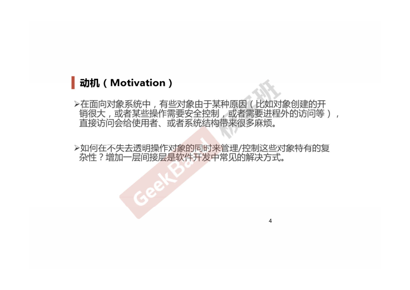
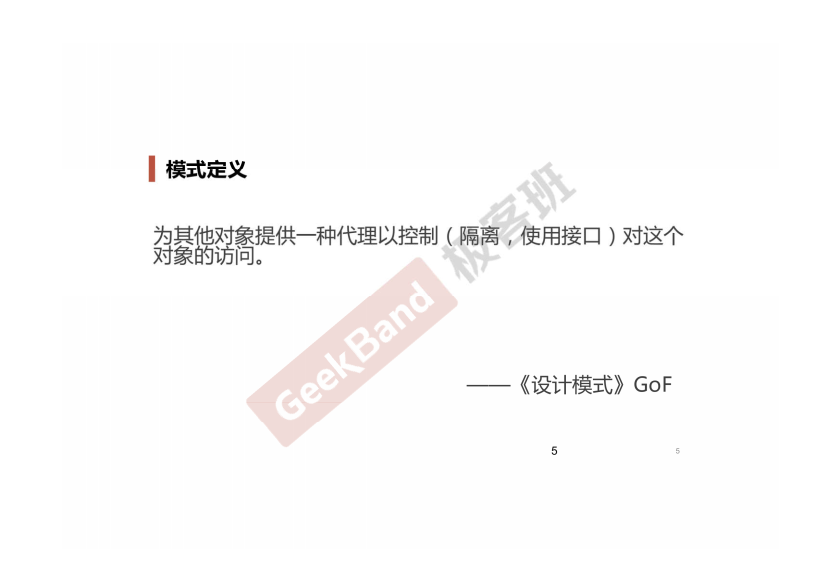
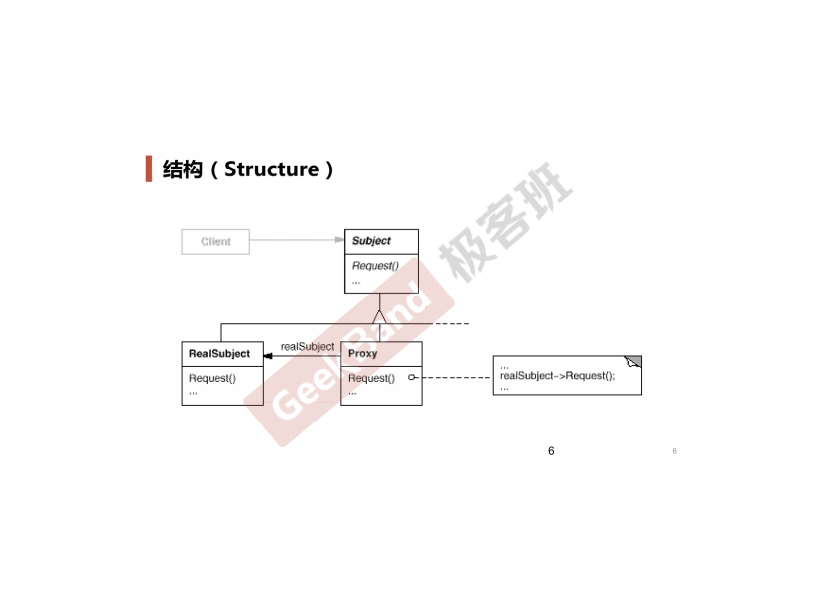
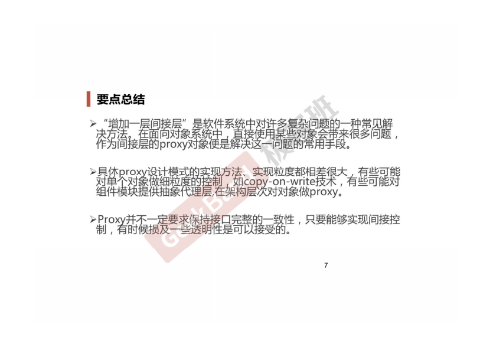

### 一. 导入: Proxy模式





### 二. 举例说明

**第一版**

```cpp
class ISubject
{
public:
    virtual void process();
};

class RealSubject: public ISubject
{
public:
    virtual void process()
    {
        //...
    }
};

class ClientApp
{
    ISubject* subject;

public:
    ClientApp()
    {
        subject = new RealSubject();  // 由于某些原因, 比如说分布式情况下, RealSubject并不是很容易获取.
    }

    void DoTask()
    {
        //...
        subject->process();    
        //....
    }
};
```

**Proxy版本**

```cpp
class ISubject 
{
public:
    virtual void process();
};

// Proxy的设计
class SubjectProxy: public ISubject
{
public:
    virtual void process()
    {
        // 对RealSubject的一种间接访问
        // ...
    }
};

class ClientApp
{
    ISubject* subject;

public:
    ClientApp()
    {
        subject = new SubjectProxy();
    }

    void DoTask()
    {
        // ...
        subject->process();
        // ...
    }
};
```

### 三. 结构总结



