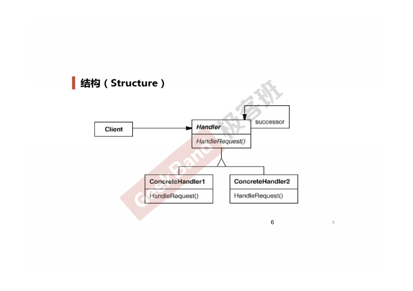

### 一. 导入: Chain of Responsibility模式


### 二. 举例说明

```cpp
#include <iostream>
#include <string>

using namespace std;

enum class RequestType
{
    REQ_HANDLER1,
    REQ_HANDLER2,
    REQ_HANDLER3
};

class Request
{
    string description;
    RequestType reqType;

public:
    Request(const string &desc, RequestType type): description(desc), reqType(type){}
    RequestType getReqType() const { return reqType; }
    const string& getDescription() const { return description; }
};

class ChainHandler
{
    ChainHandler *nextChain;
    void sendRequestToNextHandler(const Request &req)
    {
        if (nextChain != nullptr)
        {
            nextChain->handle(req);
        }
    }

protected:
    virtual bool canHandleRequest(const Request &req) = 0;
    virtual void processRequest(const Request &req) = 0;

public:
    ChainHandler() {nextChain = nullptr;}
    void setNextChain(ChainHandler *next) {nextChain = next;}

    void handle(const Request &req)
    {
        if (canHandleRequest(req))
        {
            processRequest(req);
        }
        else
        {
            sendRequestToNextHandler(req);
        }
    }
};

class Handler1: public ChainHandler
{
protected:
    bool canHandleRequest(const Reqest & req) override
    {
        return req.getReqType() == RequestType::REQ_HANDLER1;
    }

    void processRequest(const Request &req) override
    {
        cout << "Handler1 is handle reqest: " << req.getDescription() << endl;
    }
};

class Handler2: public ChainHandler
{
protected:
    bool canHandleRequest(const Reqest & req) override
    {
        return req.getReqType() == RequestType::REQ_HANDLER2;
    }

    void processRequest(const Request &req) override
    {
        cout << "Handler2 is handle reqest: " << req.getDescription() << endl;
    }
};

class Handler3: public ChainHandler
{
protected:
    bool canHandleRequest(const Reqest & req) override
    {
        return req.getReqType() == RequestType::REQ_HANDLER3;
    }

    void processRequest(const Request &req) override
    {
        cout << "Handler3 is handle reqest: " << req.getDescription() << endl;
    }
};

int main(int argc, char *argv[])
{
    Handler1 h1;
    Handler2 h2;
    Handler3 h3;
    h1.setNextChain(&h2);
    h2.setNextChain(&h3);

    Reqest req("process task ... ", RequestType::REQ_HANDLER3);
    h1.handle(req);
    return 0;
}
```

### 三. 结构总结



