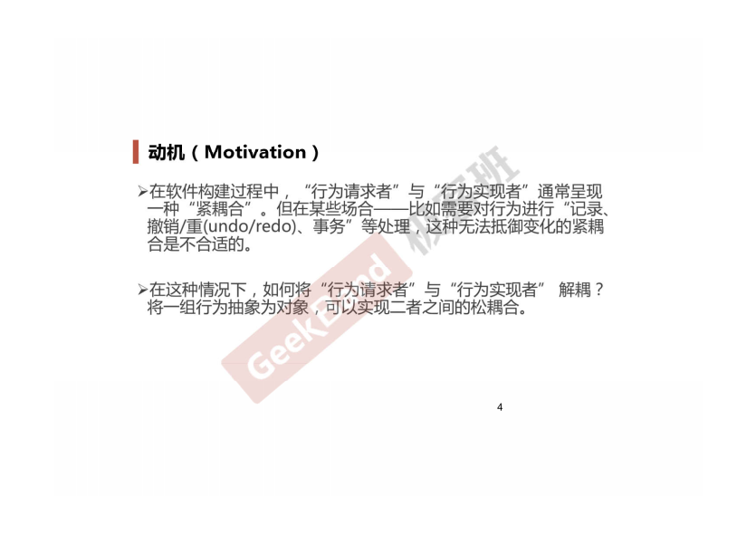
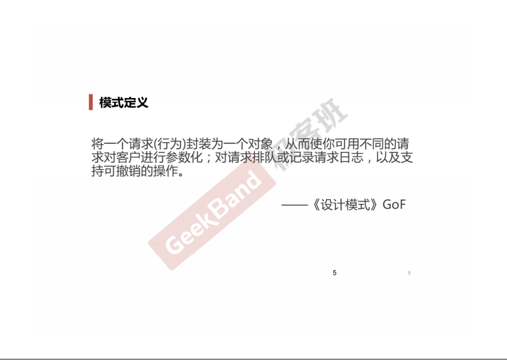

### 一. 导入: Command模式





### 二. 举例说明

```cpp
#include <iostream>
#include <vector>
#include <string>

using namespace std;

class Command
{
public:
    virtual void execute() = 0;
};

class ConcreteCommand1: public Command
{
    string arg;
public:
    ConcreteCommand1(const string &a): arg(a){}
    void execute() override
    {
        cout << "#1 process..." << arg << endl;
    }
};

class ConcerteCommand2: public Command
{
    string arg;
public:
    ConcreteCommand2(const string &a): arg(a){}
    void execute() override
    {
        cout << "#2 process..." << arg << endl;
    }
};

class MacroCommand: public Command
{
    vector<Command*> commands;

public:
    void addCommand(Command *c)
    {
        commands.push_back(c);
    }
    void execute() override
    {
        for (auto &c: commands)
        {
            c->execute();
        }
    }
};

int main(int argc, char *argv[])
{
    ConcreteCommand1 command1(receiver, "Arg ###");
    ConcreteCommand1 command1(receiver, "Arg $$$");

    MacroCommand macro;
    macro.addCommand(&command1);
    macro.addCommand(&command2);

    macro.execute();

    return 0;
}
```

### 三. 结构总结