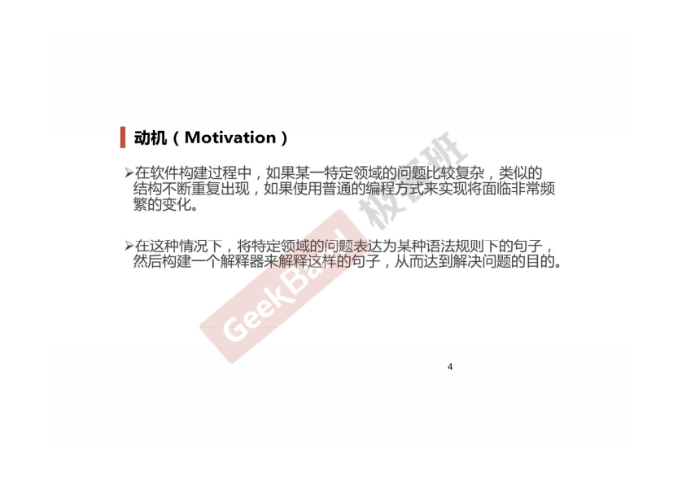
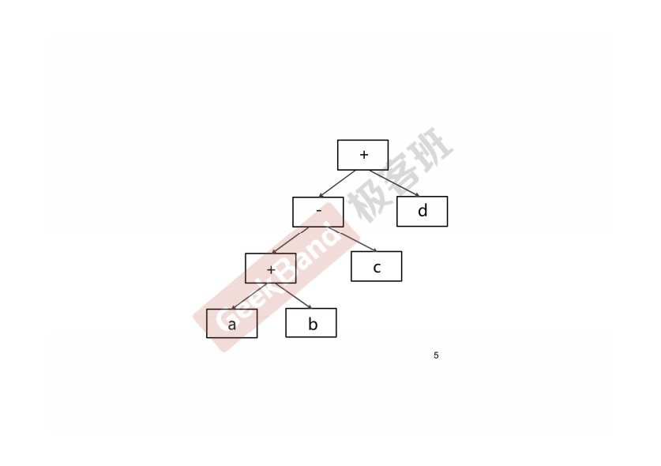
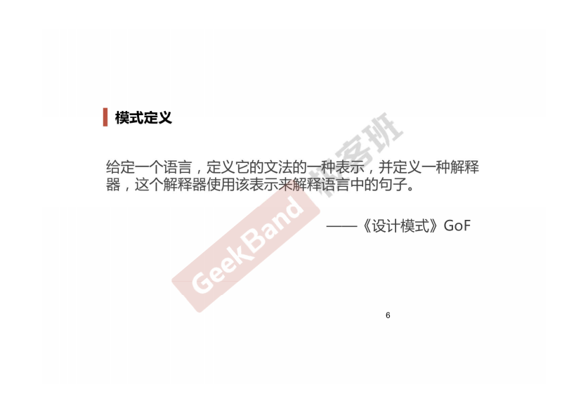
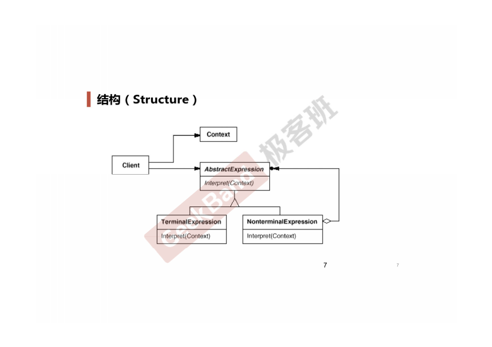

### 一. 导入: Interpreter模式







### 二. 举例说明

```cpp
#include <iostream>
#include <map>
#include <stack>


using namespace std;

class Expression
{
public:
    virtual int interpreter(map<char, int> var) = 0;
    virtual ~Expression(){}
};

// 变量表达式
class VarExpression: public Expression
{
    char key;

public:
    VarExpression(const char& key)
    {
        this->key = key;
    }

    int interpreter(map<char, int> var) override 
    {
        return var[key];
    }
};

// 符号表达式
class SymbolExpression: public Expression {
    
    // 运算符左右两个参数
protected:
    Expression* left;
    Expression* right;
    
public:
    SymbolExpression(Expression* left,  Expression* right):
        left(left),right(right)
        {
        }  
};

// 加法运算
class AddExpression: public SymbolExpression
{
public:
    AddExpression(Expression* left, Expression *right):SymbolExpression(left, right){}

    int interpreter(map<char, int> var) override 
    {
        return left->interpreter(var) + right->interpreter(var); 
    }
};

// 减法运算
class SubExpression: public SymbolExpression
{
public:
    SubExpression(Expression* left, Expression* right):SymbolExpression(left, right){}

    int interpreter(map<char, int> var) override 
    {
        return left->interpreter(var) - right->interpreter(var);
    }
};

Expression* analyse(string expStr)
{
    stack<Expression *> expStack;
    Expression* left = nullptr;
    Expression* right = nullptr;

    for (int i = 0; i < expStr.size(); i++)
    {
        switch(expStr[i])
        {
            case '+':
                // 加法运算
                left = expStack.top();
                right = new VarExpression(expStr[++i]);
                expStack.push(new AddExpression(left, right));
                break;

            case '-':
                // 减法运算
                left = expStack.top();
                right = new VarExpression(expStr[++i]);
                expStack.push(new SubExpression(left, right));
                break;

            default:
                // 变量表达式
                expStack.push(new VarExpression(expStr[i]));
        }
    }

    Expression* expression = expStack.top();

    return expression;
}

void release(Expression* expression)
{
    // 释放表达式树的节点内存...
}

int main(int argc, char *argv[])
{
    string expStr = "a+b-c+d-e";
    map<char, int> var;
    var.insert(make_pair('a',5));
    var.insert(make_pair('b',2));
    var.insert(make_pair('c',1));
    var.insert(make_pair('d',6));
    var.insert(make_pair('e',10));

    Expression* expression = analyse(expStr);

    int result = expression->interpreter(var);

    cout << result << endl;

    release(expression);

    return 0;
}
```

### 三. 结构总结




