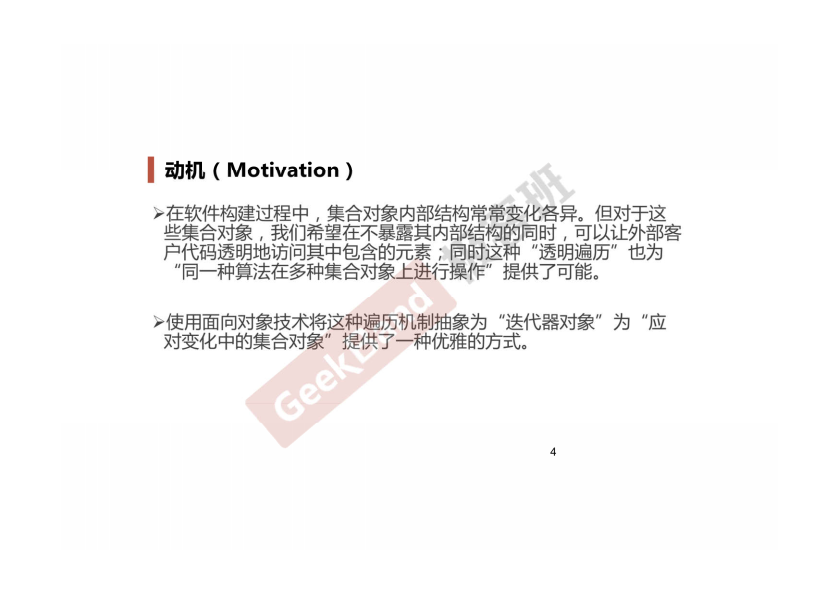
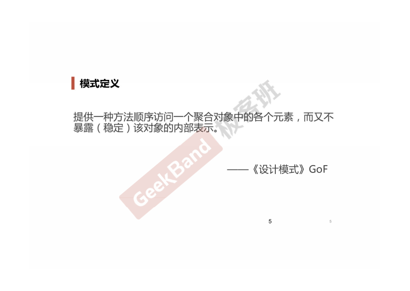
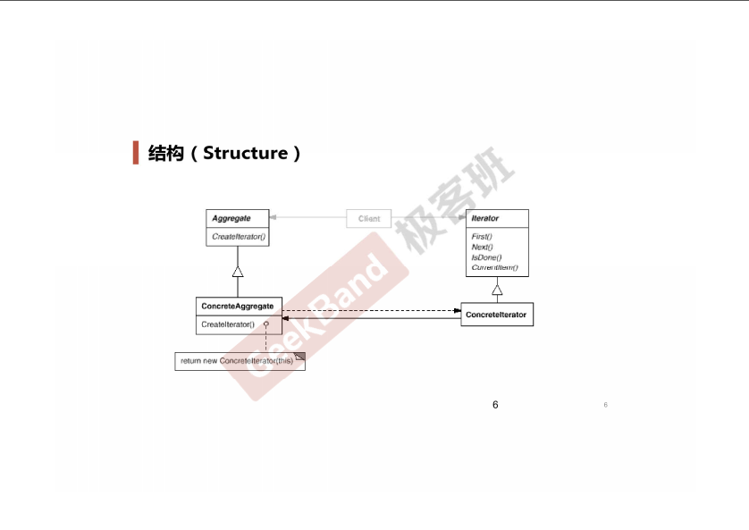

### 一. 导入: Iterator模式





### 二. 举例说明

```cpp
#include <iostream>
#include <string>
#include <vector>

using namespace std;

// 迭代抽象类, 用于定义得到开始对象、得到下一个对象、判断是否到结尾、当前对象等抽象方法，统一接口
class Iterator
{
public:
    Iterator(){}
    virtual ~Iterator(){}
    virtual string First() = 0;
    virtual string Next() = 0;
    virtual string CurrentItem() = 0;
    virtual bool IsDone() = 0;
};

// 聚集抽象类
class Aggregate
{
public:
    virtual int Count() = 0;
    virtual void Push(const string& strValue) = 0;
    virtual string Pop(const int nIndex) = 0;
    virtual Iterator* CreateIterator() = 0;
};

// 具体迭代器类, 继承Iterator 实现开始、下一个、是否结尾、当前对象等方法
class ConcreteIterator : public Iterator
{
private:
    Aggregate* m_Aggregate;
    int m_nCurrent;
public:
    ConcreteIterator(Aggregate* pAggregate) :m_nCurrent(0), Iterator()
    {
        m_Aggregate = pAggregate;
    }
    string First()
    {
        return m_Aggregate->Pop(0);
    }
    string Next()
    {
        string strRet;
        m_nCurrent++;
        if (m_nCurrent < m_Aggregate->Count())
        {
            strRet = m_Aggregate->Pop(m_nCurrent);
        }
        return strRet;
    }
    string CurrentItem()
    {
        return m_Aggregate->Pop(m_nCurrent);
    }
    bool IsDone()
    {
        return ((m_nCurrent >= m_Aggregate->Count()) ? true : false);
    }
};

// 具体聚集类 继承
class ConcreteAggregate : public Aggregate
{
private:
    vector<string> m_vecItems;
    Iterator* m_pIterator;

public:
    ConcreteAggregate() :m_pIterator(NULL)
    {
        m_vecItems.clear();
    }
    ~ConcreteAggregate()
    {
        if (NULL != m_pIterator)
        {
            delete m_pIterator;
            m_pIterator = NULL;
        }
    }
    Iterator* CreateIterator()
    {
        if (NULL == m_pIterator)
        {
            m_pIterator = new ConcreteIterator(this);
        }
        return m_pIterator;
    }
    int Count()
    {
        return m_vecItems.size();
    }
    void Push(const string& strValue)
    {
        m_vecItems.push_back(strValue);
    }
    string Pop(const int nIndex)
    {
        string strRet;
        if (nIndex < Count())
        {
            strRet = m_vecItems[nIndex];
        }
        return strRet;
    }
};

int main(int argc, char *argv[])
{
    ConcreteAggregate* pName = NULL;
    pName = new ConcreteAggregate();
    if (NULL != pName)
    {
        pName->Push("hello");
        pName->Push("word");
        pName->Push("cxue");
    }
    Iterator* iter = NULL;
    iter = pName->CreateIterator();
    if (NULL != iter)
    {
        string strItem = iter->First();
        while (!iter->IsDone())
        {
            cout << iter->CurrentItem() << " is ok" << endl;
            iter->Next();
        }
    }

    return 0;
}
```

### 三. 结构总结



