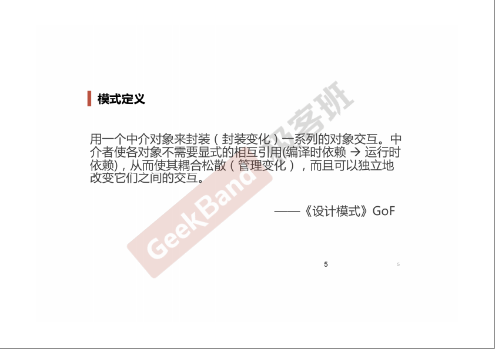
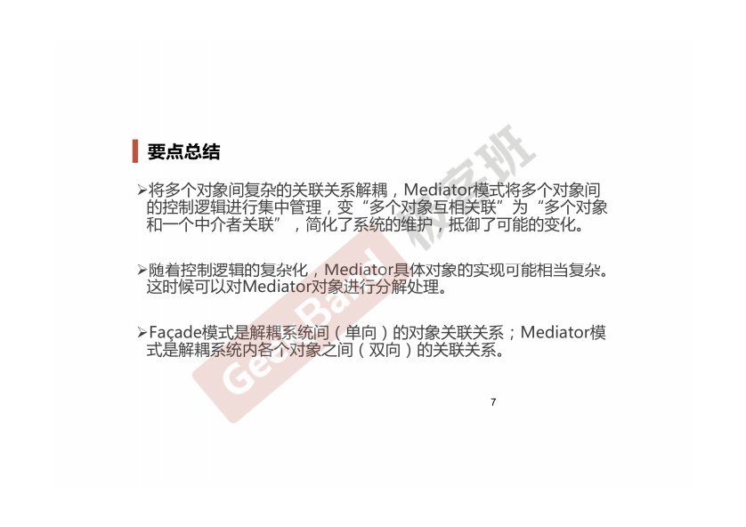

### 一. 导入: Mediator模式




### 二. 举例说明

```cpp
#include <iostream>

using namespace std;

#define SAFE_DELETE(p) if (p) {delete p; p = NULL;}

class Mediator;

class Colleague
{
public:
     Colleague(Mediator *pMediator) : m_pMediator(pMediator){}
 
     virtual void Send(wchar_t *message) = 0;
 
protected:
     Mediator *m_pMediator;
};

class ConcreteColleague1: public Colleague
{
public:
    ConcreteColleague1(Mediator *pMediator) : Colleague(pMediator){}
 
    void Send(wchar_t *message);
 
    void Notify(wchar_t *message)
    {
        cout << "ConcreteColleague1 is handling the message." << endl;
        cout << message << endl;
    }
};
 
class ConcreteColleague2: public Colleague
{
public:
    ConcreteColleague2(Mediator *pMediator) : Colleague(pMediator){}
 
    void Send(wchar_t *message);
 
    void Notify(wchar_t *message)
    {
        cout << "ConcreteColleague2 is handling the message." << endl;
        cout << message << endl;
     }
};

class Mediator
{
public:
     virtual void Sent(wchar_t *message, Colleague *pColleague) = 0;
};

class ConcreteMediator : public Mediator
{
public:
     // The mediator forward the message
     void Sent(wchar_t *message, Colleague *pColleague)
     {
        ConcreteColleague1 *pConcreteColleague1 = dynamic_cast<ConcreteColleague1 *>(pColleague);
        if (pConcreteColleague1)
        {
            cout << "The message is from ConcreteColleague1. Now mediator forward it to ConcreteColleague2" << endl;
            if (m_pColleague2)
            {
                m_pColleague2->Notify(message);
            }
        }
        else
        {
            if (m_pColleague1)
            {
                m_pColleague1->Notify(message);
            }
        }
     }
 
     void SetColleague1(Colleague *pColleague)
     {
        m_pColleague1 = dynamic_cast<ConcreteColleague1 *>(pColleague);
     }
 
     void SetColleague2(Colleague *pColleague)
     {
        m_pColleague2 = dynamic_cast<ConcreteColleague2 *>(pColleague);
     }
 
private:
     // The Mediator knows all the Colleague
     ConcreteColleague1 *m_pColleague1;
     ConcreteColleague2 *m_pColleague2;
};

void ConcreteColleague1::Send(wchar_t *message)
{
    // The second parameter mark where the message comes from
    m_pMediator->Sent(message, this);
}
 
void ConcreteColleague2::Send(wchar_t *message)
{
    m_pMediator->Sent(message, this);
}

int main()
{
    // Create the mediator
    Mediator *pMediator = new ConcreteMediator();

    Colleague *pColleague1 = new ConcreteColleague1(pMediator);
    Colleague *pColleague2 = new ConcreteColleague2(pMediator);

    ConcreteMediator *pConcreteMediator = dynamic_cast<ConcreteMediator *>(pMediator);
    pConcreteMediator->SetColleague1(pColleague1);
    pConcreteMediator->SetColleague2(pColleague2);

    wchar_t message[260] = L"Where are you from?";
    pColleague1->Send(message);

    return 0;
}
```

### 三. 结构总结


