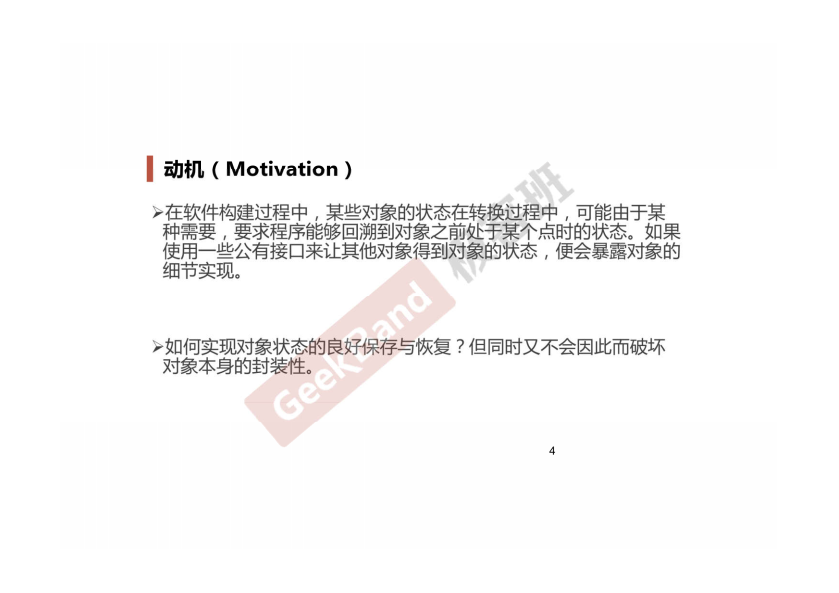
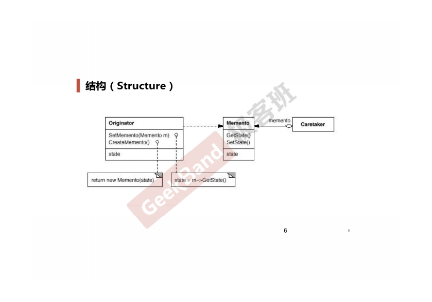
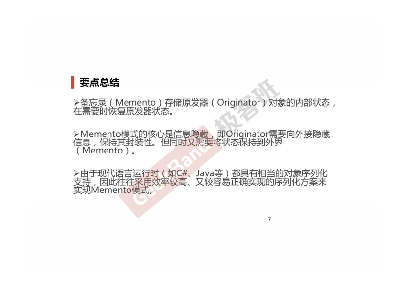

### 一. 导入: Memento模式




### 二. 举例说明

```cpp
class Memento
{
    string state;
    //...
public:
    Memento(const string &s): state(s){}
    string getState() const {return state;}
    void setState(const string &s){ state = s; }
};

class Originator
{
    string state;
    // ...
public:
    Originator() {}
    Memento createMomento() 
    {
        Memento m(state);
        return m;
    }

    void setMomento(const Memento &m)
    {
        state = m.getState();
    }
};

int main(int argc, char *argv[])
{
    Originator orginator;
    
    //捕获对象状态，存储到备忘录
    Memento mem = orginator.createMomento();
    
    //... 改变orginator状态
    
    //从备忘录中恢复
    orginator.setMomento(memento);   
}
```

### 三. 结构总结



