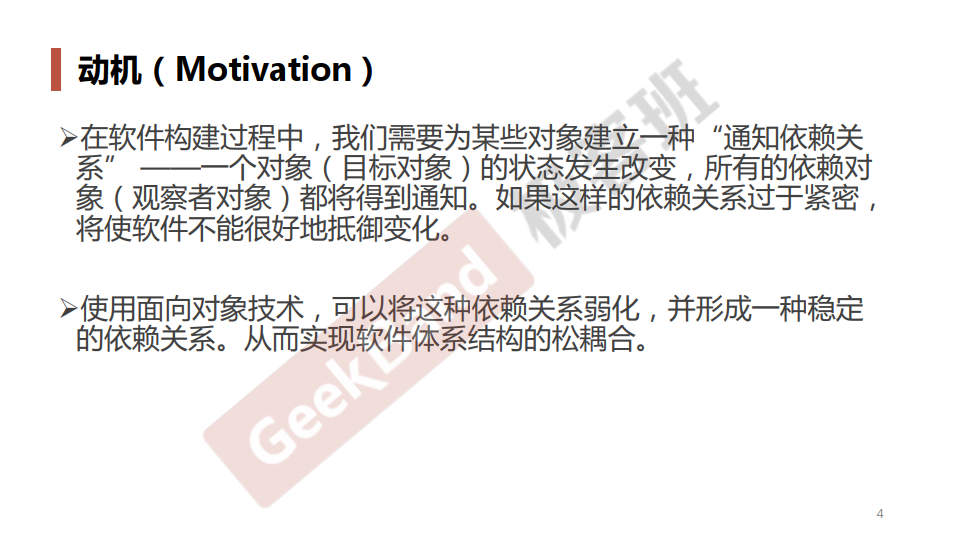
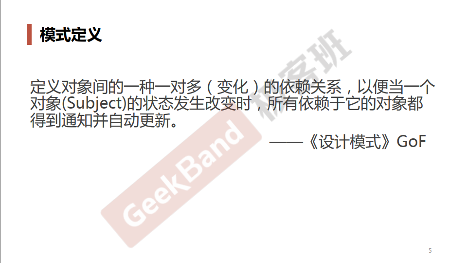
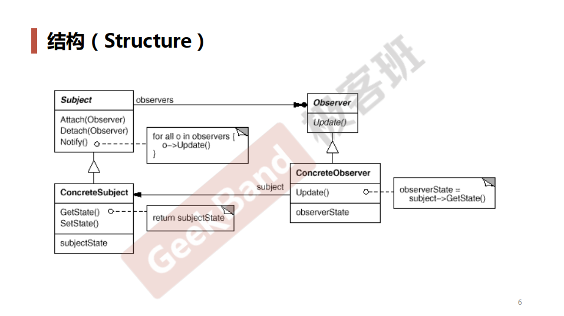
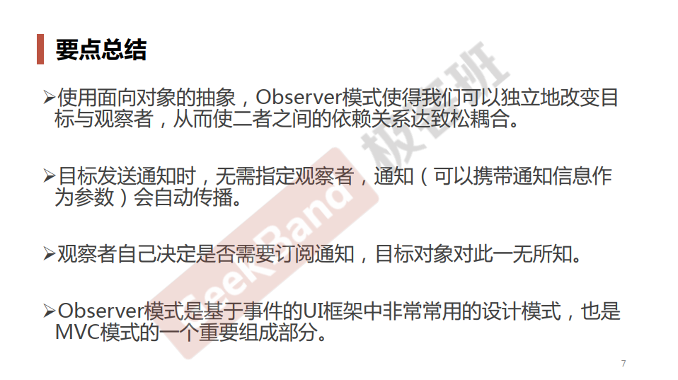

### 一. 导入: Observer模式





### 二. 举例说明

```cpp
class Observer
{
public:
    virtual ~Observer(){}
    virtual void Update(const std::string &msg) = 0;

protected:
    Observer(){}
};

class Listener
{
public:
    virtual ~Listener() {}
    void attach(Observer* obsvr) 
    {
        m_observers.push_back(obsvr);
    }
  
    void remove(Observer* obsvr)
    {
        m_observers.remove(obsvr);
    }
  
    void notify(const std::string &msg)
    {
        list<Observer*>::iterator iter = m_observers.begin(); 
        for(; iter != m_observers.end(); iter++) 
            (*iter)->Update(msg); 
    }

private: 
    list<Observer* > m_observers; // 观察者链表 
};

class logRunner: public Listener
{
public:
    virtual ~logRunner(){}
    void addmsg(const std::string &msg)
    {
        nofity(msg);
    }
};

class logGui: public Observer
{
public:
    virtual ~Observer(){}
    void Update(const std::string &msg)
    {
        cout<< "Gui log show : "<< msg <<endl;
    }
};
 
class logFile: public Observer
{
public:
    virtual ~Observer(){}
    void Update(const std::string &msg)
    {
        cout<< "file log write : "<< msg <<endl;
    }
};
 
class logDebug: public Observer
{
public:
    virtual ~Observer(){}
    void Update(const std::string &msg)
    {
        cout<< "Debug log out : "<< msg <<endl;
    }
};

class logDataBase: public Observer
{
public:
    virtual ~Observer(){}
    void Update(const std::string &msg)
    {
        cout<< "DataBase log in : "<< msg <<endl;
    }
};

int main(int argc, char *argv[])
{
    logRunner Runner;
    logGui gGui;
    logFile gFile;
    logDebug gDebug;
    logDataBase gDataBase;
   
    Runner.attach(&gGui);
    Runner.attach(&gFile);
    Runner.attach(&gDebug);
    Runner.attach(&gDataBase);
   
    Runner.addmsg("app is setup");

    return 0;
}
```

### 三. 结构总结




