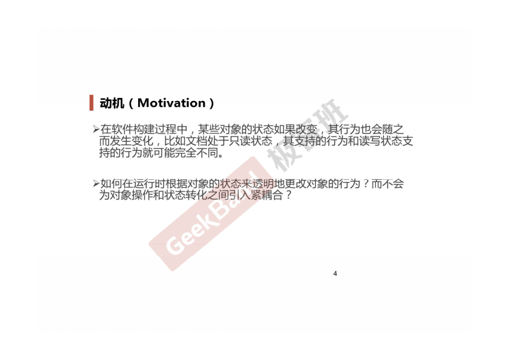
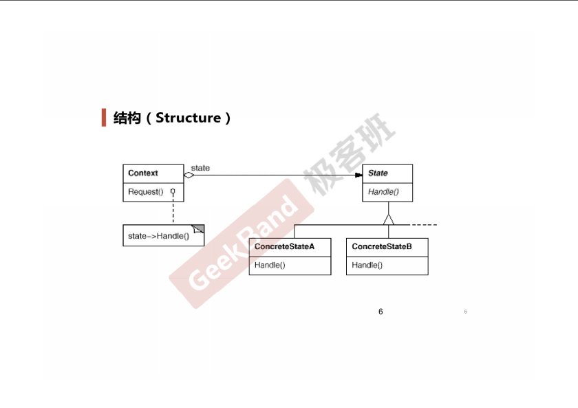
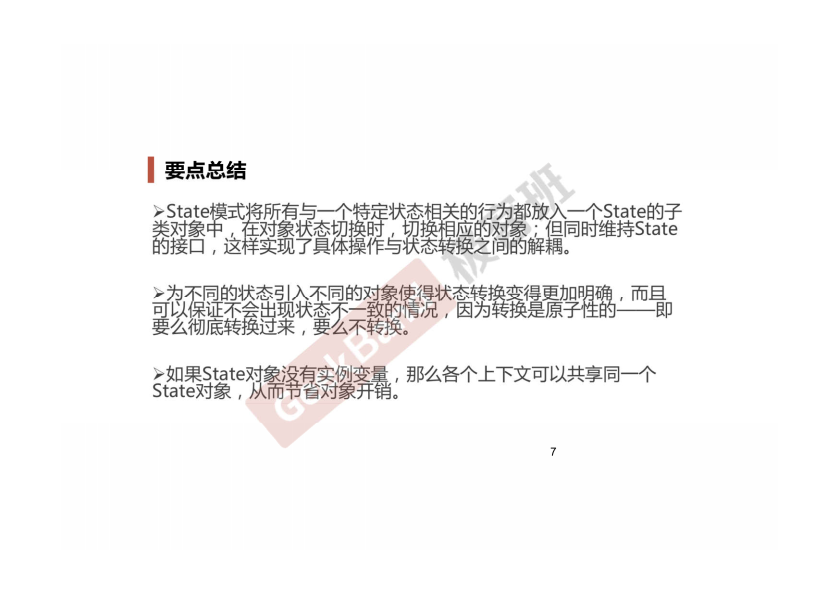

### 一. 导入: State模式




### 二. 举例说明

**原始版本**

```cpp
enum NetworkState
{
    Network_Open,
    Network_Close,
    Network_Connect,
};

class NetworkProcessor
{
    NetworkState state;

public:
    void Operation1()
    {
        if (state == Network_Open)
        {
            //********
            state = Network_Close;
        }
        else if (state == Network_Close)
        {
            //........
            state = Network_Connect;
        }
        else if (state == Network_Connect)
        {
            //$$$$$$$$
            state = Network_Open;
        }
    }

    void Operation2()
    {
        if (state == Network_Open)
        {
            //********
            state = Network_Connect;
        }
        else if (state = Network_Connect)
        {
            //........
            state = Network_Open;
        }
        else if (state == Network_Connect)
        {
            //$$$$$$$$
            state = Network_Close;
        }

    }

    void Operation3()
    {

    }
};
```

**采用State模式改进版本**

```cpp
class NetworkState
{
public:
    NetworkState* pNext;
    virtual void Operation1() = 0;
    virtual void Operation2() = 0;
    virtual void Operation3() = 0;

    virtual ~NetworkState(){}
};

class OpenState: public NetworkState
{
    state NetworkState* m_instance;

public:
    static NetworkState* getInstance()
    {
        if (m_instance == nullptr)
        {
            m_instance = new OpenState();
        }
        return m_instance;
    }

    void Operation1()
    {
        //********
        pNext = CloseState::getInstance();
    }

    void Operation2()
    {
        //........
        pNext = ConnectState::getInstance();
    }

    void Operation3()
    {
        //$$$$$$$$
        pNext = OpenState::getInstance();
    }
};

class CloseState: public NetworkState{ };

class ConnectState: public NetworkState{ };

class NetworkProcessor {
    NetworkState* pState;

public:
    NetworkProcessor(NetworkState* pState)
    {    
        this->pState = pState;
    }

    void Operation1()
    {
        //...
        pState->Operation1();
        pState = pState->pNext;
        //...
    }

    void Operation2()
    {
        //...
        pState->Operation2();
        pState = pState->pNext;
        //...
    }
    
    void Operation3()
    {
        //...
        pState->Operation3();
        pState = pState->pNext;
        //...
    }
};
```

### 三. 结构总结





