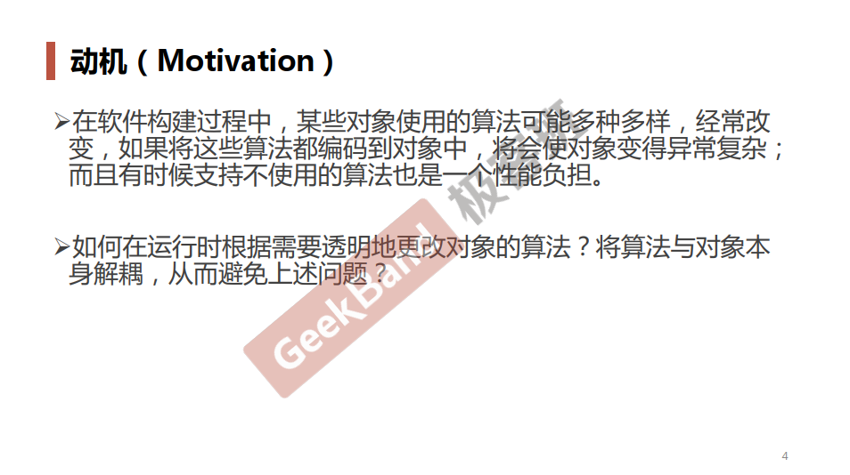
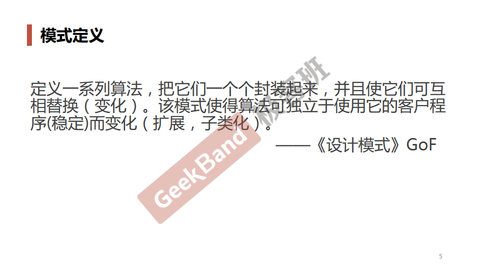
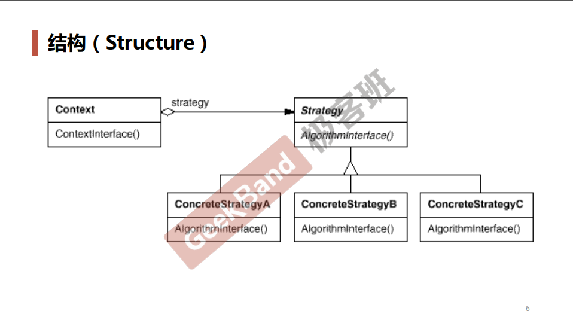
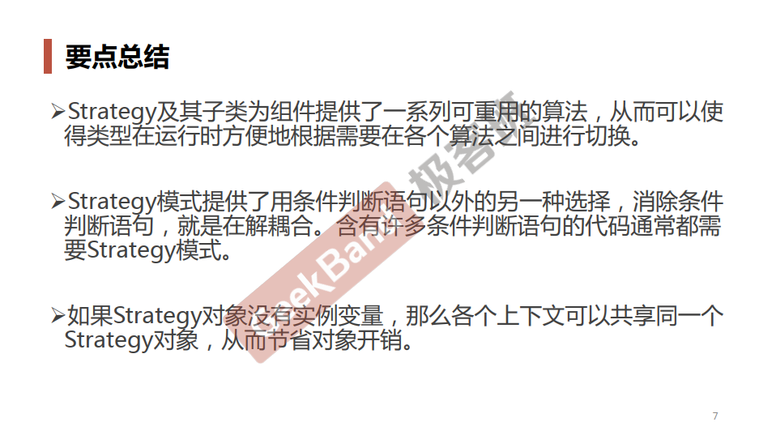

### 一. 导入: Strategy模式





### 二. 举例说明

**原始版本**

```cpp
enum TaxBase 
{
    CN_Tax,
    US_Tax,
    DE_Tax,
    FR_Tax    // 更改
};

class SalesOrder
{
    TaxBase tax;

public:
    double CalculateTax()
    {
        //...
        if (tax == CN_Tax)
        {
            // CN********
        }
        else if (tax == US_Tax)
        {
            // US********
        }
        else if (tax == DE_Tax)
        {
            // DE********
        }
        ekse if (tax == FR_Tax) // 更改
        {
            // ...
        }

        // ...
    }
};
```

**采用Strategy模式改进版本**

```cpp
class TaxStrategy
{
public:
    virtual double Calculate(const Context& context) = 0;
    virtual ~TaxStrategy(){ }
};

class CNTax: public TaxStrategy
{
public:
    virtual double Calculate(const Context& context)
    {
        //***********
    }
};

class USTax: public TaxStrategy
{
public:
    virtual double Calculate(const Context& context)
    {
        //***********
    }
};

class DETax: public TaxStrategy
{
public:
    virtual double Calculate(const Context& context)
    {
        //***********
    }
};

// 扩展
// *************************
class FRTax: public TaxStrategy
{
public:
	virtual double Calculate(const Context& context)
    {
		//.........
	}
};

class SalesOrder
{
private:
    TaxStrategy* strategy;

public:
    SalesOrder(StrategyFactory* strategyFactory)
    {
        this->strategy = strategyFactory->NewStrategy();
    }
    ~SalesOrder()
    {
        delete this->strategy;
    }

    double CalculateTax()
    {
        //...
        Context context();
        
        double val = 
            strategy->Calculate(context); //多态调用
        //...
    }
};
```

### 三. 结构总结




