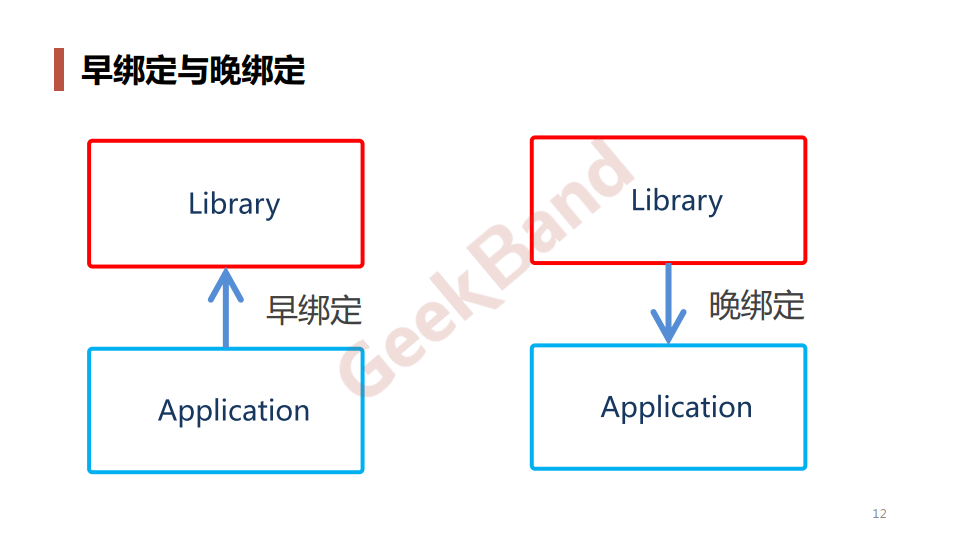

### 一. 导入: Template Method模式





### 二. 举例说明

**结构化方式**

template1_lib.cpp

```cpp
// 程序库开发人员
class Library
{
public:
    void Step1() 
    {
        //...
    }

    void Step3()
    {
        //...
    }

    void Step5()
    {
        //...
    }
};
```

template1_app.cpp

```cpp
// 应用开发人员
class Application
{
public:
    bool Step2()
    {
        //...
    }

    void Step4()
    {
        //...
    }
};

int main(int argc, char *argv[])
{
    Library lib();
    Application app();

    lib.step1();

    if (app.Step2())
    {
        lib.Step3();
    }

    for (int i = 0; i < 4; i++)
    {
        app.Step4();
    }

    lib.Step5();
    return 0;
}
```

**Template Method方法**

template2_lib.cpp

```cpp
// 程序库开发人员
class Library
{
public:
    // 稳定 template method
    void Run()
    {
        Step1();

        if (Step2()) // 支持变化 ==> 虚函数的多态调用
        {
            Step3();
        }

        for (int i = 0; i < 4; i++)
        {
            Step4();  // 支持变化 ==> 虚函数的多态调用
        }

        Step5();
    }

    virtual ~Library(){ }

protected:
    void Step1()  // 稳定
    {
        //...
    }

    void Step3()  // 稳定
    {
        //...
    }

    void Step5()  // 稳定
    {
        //...
    }

    virtual bool Step2() = 0;  // 变化
    virtual void Step4() = 0;  // 变化
};
```

template2_app.cpp

```cpp
// 应用程序开发人员
class Application: public Library
{
protected:
    virtual bool Step2()
    {
        //... 子类重写实现
    }

    virtual void Step4()
    {
        //... 子类重写实现
    }
};

int main(int argc, char *argv[])
{
    Library* pLib = new Application();
    lib->Run();

    delete pLib;
}
```

### 三. 结构总结


