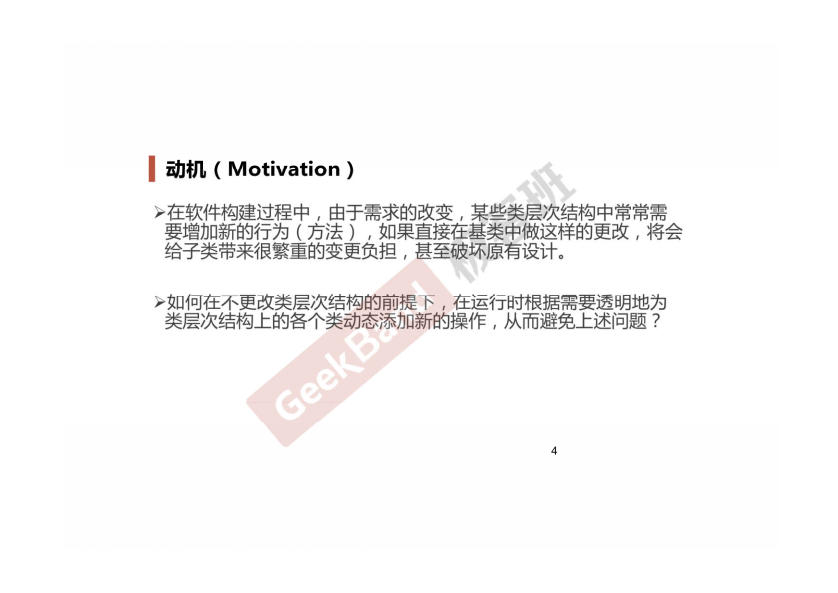
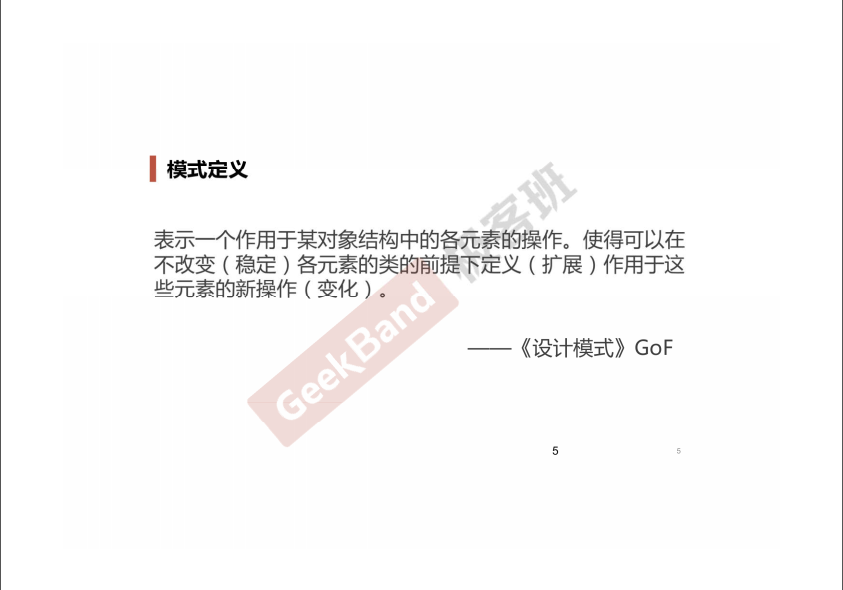
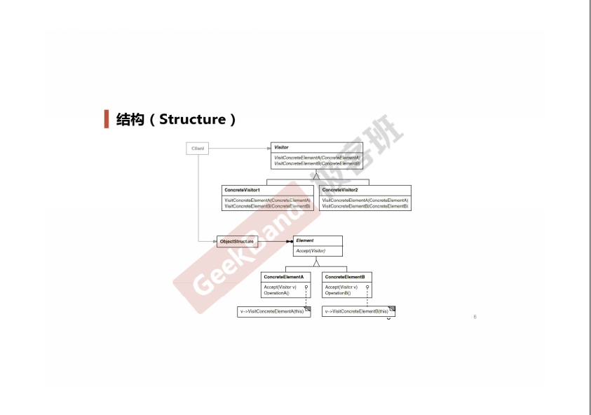
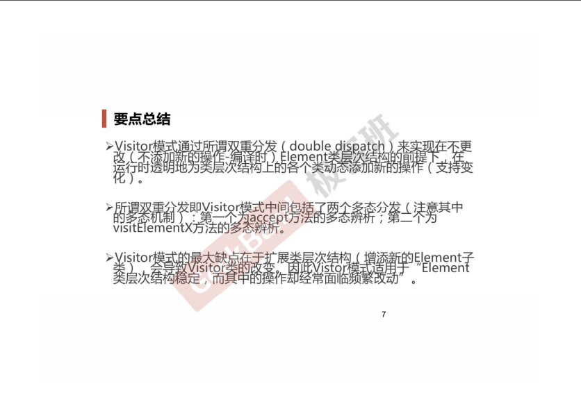

### 一. 导入: Visitor模式





### 二. 举例说明

**初始版本**

```cpp
#include <iostream>

using namespace std;

class Visitor;

class Element
{
public:
    virtual void Func1() = 0;

    virtual void Func2(int data) = 0;
    virtual void Func3(int data) = 0;
    // ...

    virtual ~Element(){}
};

class ElementA: public Element
{
public:
    void Func1() override
    {
        //...
    }

    void Func2(int data) override
    {
        //...
    }
};

class ElementB: public Element
{
public:
    void Func1() override
    {
        //***
    }

    void Func2(int data) override
    {
        //***
    }
}
```

**采用Visitor模式**

```cpp
#include <iostream>

using namespace std;

class Visitor;

class Element
{
public:
    virtual void accept(Visitor& visitor) = 0; // 第一次多态辨析

    virtual ~Element(){ }
};

class ElementA: public Element
{
public:
    void accept(Visitor &visitor) override
    {
        visitor.visitElementA(*this);
    }
};

class ElementB: public Element
{
public:
    void accept(Visitor &visitor) override
    {
        visitor.visitElementB(*this); // 第二次多态辨析
    }
};

class Visitor
{
public:
    virtual void visitElementA(ElementA &element) = 0;
    virtual void visitElementB(ElementB &element) = 0;

    virtual ~Visitor(){ }
};

//=========================================
// 扩展1
class Visitor1 : public Visitor
{
public:
    void visitElementA(ElementA& element) override
    {
        cout << "Visitor1 is processing ElementA" << endl;
    }
        
    void visitElementB(ElementB& element) override
    {
        cout << "Visitor1 is processing ElementB" << endl;
    }
};

//扩展2
class Visitor2 : public Visitor
{
public:
    void visitElementA(ElementA& element) override
    {
        cout << "Visitor2 is processing ElementA" << endl;
    }
    
    void visitElementB(ElementB& element) override
    {
        cout << "Visitor2 is processing ElementB" << endl;
    }
};

int main(int argc, char *argv[])
{
    Visitor2 visitor;
    ElementB elementB;
    elementB.accept(visitor); // double dispatch

    ElementA elementA;
    elementA.accept(visitor);

    return 0;
}
```


### 三. 结构总结

访问器模式要求比较苛刻, Element的子类个数必须是确定的, 但对Element的操作却是频繁改动的.





